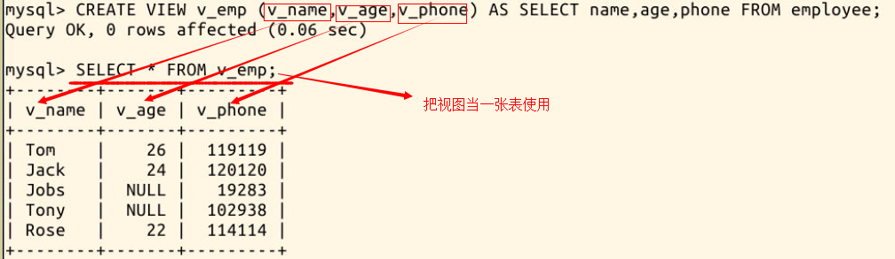

#### 3.2 视图 `一种虚拟的表`

2022年3月30日16:58:51

---

视图是从一个或多个表中导出来的表，是一种**虚拟存在的表**。它就像一个窗口，通过这个窗口可以看到系统专门提供的数据，这样，用户可以不用看到整个数据库中的数据，而只关心对自己有用的数据。

注意理解视图是虚拟的表：

- **数据库中只存放了视图的定义，**而没有存放视图中的数据，这些数据存放在原来的表中；
- 使用视图查询数据时，数据库系统会从原来的表中取出对应的数据；
- 视图中的数据依赖于原来表中的数据，一旦表中数据发生改变，显示在视图中的数据也会发生改变；
- 在使用视图的时候，可以把它当作一张表。

创建视图的语句格式为：

```sql
CREATE VIEW 视图名(列a,列b,列c) AS SELECT 列1,列2,列3 FROM 表名字;
```

可见创建视图的语句，后半句是一个 SELECT 查询语句，所以**视图也可以建立在多张表上**，只需在 SELECT 语句中使用**子查询**或**连接查询**，这些在之前的实验已经进行过。

现在我们创建一个简单的视图，名为 **v_emp**，包含**v_name**，**v_age**，**v_phone**三个列：

```sql
CREATE VIEW v_emp (v_name,v_age,v_phone) AS SELECT name,age,phone FROM employee;
```




