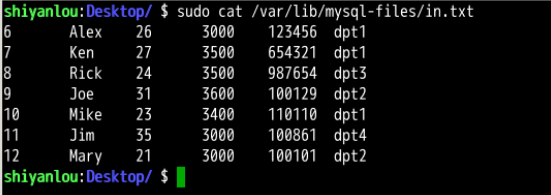
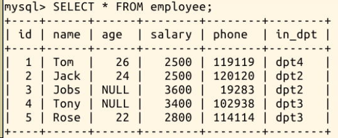
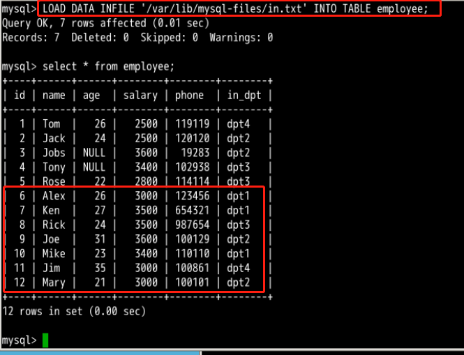

#### 3.3 导入     `TXT格式  `安全目录`   `load data infile xxxx into tablename`

2022年3月30日17:38:17

**此处讲解的是导入一个纯数据文件**，该文件中将包含与数据表字段相对应的多条数据，这样可以快速导入大量数据，除此之外，还有用 SQL 语句的导入方式，语法为：`source *.sql` 这是实验中经常用到的。**两者之间的不同是：数据文件导入方式只包含数据，导入规则由数据库系统完成；SQL 文件导入相当于执行该文件中包含的 SQL 语句，**可以实现多种操作，包括删除，更新，新增，甚至对数据库的重建。

数据文件导入，可以把一个文件里的数据保存进一张表。导入语句格式为：

```sql
LOAD DATA INFILE '文件路径和文件名' INTO TABLE 表名字;
```

现在桌面上有一个名C为 **in.txt** 的文件，我们尝试把这个文件中的数据导入数据库 **mysql_shiyan** 的 **employee** 表中。

由于导入导出大量数据都属于敏感操作，根据 mysql 的安全策略，导入导出的文件都必须在指定的路径下进行，在 mysql 终端中查看路径变量：

```bash
mysql -uroot
mysql> show variables like '%secure%';
+--------------------------+-----------------------+
| Variable_name            | Value                 |
+--------------------------+-----------------------+
| require_secure_transport | OFF                   |
| secure_auth              | ON                    |
| secure_file_priv         | /var/lib/mysql-files/ |
+--------------------------+-----------------------+
3 rows in set (0.00 sec)
```

注意到 secure_file_priv 变量指定安全路径为 `/var/lib/mysql-files/` ，要导入数据文件，需要将该文件移动到安全路径下。

打开 Xfce 终端，输入命令拷贝 `in.txt` 文件夹到 `/var/lib/mysql-files/` 目录：

```bash
sudo cp -a /home/shiyanlou/Desktop/in.txt /var/lib/mysql-files/
```

使用命令 `sudo cat /var/lib/mysql-files/in.txt` 查看 `in.txt` 文件中的内容：



可以看到其中仅仅包含了数据本身，没有任何的 SQL 语句

再使用以下命令以 root 用户登录数据库，再连接 **mysql_shiyan** 数据库：

```bash
# 在Xfce 终端输入命令
mysql -u root

# 在 MySQL 控制台中输入命令
use mysql_shiyan
```

查看一下没有导入数据之前，employee 表中的数据：



现在执行导入语句，文件中的数据成功导入 employee 表：

```sql
LOAD DATA INFILE '/var/lib/mysql-files/in.txt' INTO TABLE employee;
```




