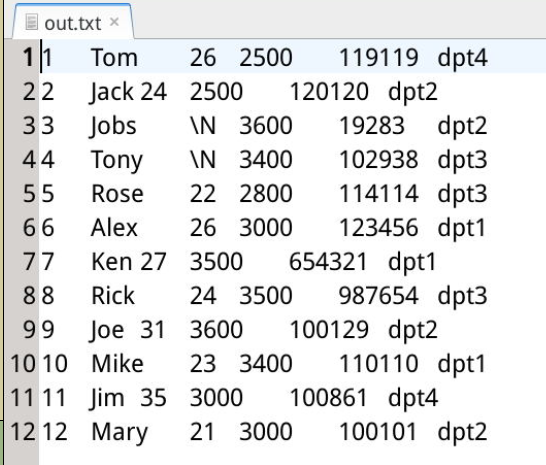

#### 3.4 导出

2022年3月30日17:54:31

---

导出与导入是相反的过程，C是把数据库某个表中的数据保存到一个文件之中。导出语句基本格式为：

```sql
SELECT 列1，列2 INTO OUTFILE '文件路径和文件名' FROM 表名字;
```

**注意：语句中 “文件路径” 之下不能已经有同名文件。**

现在我们把整个 employee 表的数据导出到 /var/lib/mysql-files/ 目录下，导出文件命名为 **out.txt** 具体语句为：

```sql
SELECT * INTO OUTFILE '/var/lib/mysql-files/out.txt' FROM employee;
```

用 gedit 可以查看导出文件 `/var/lib/mysql-files/out.txt` 的内容：

> 也可以使用 `sudo cat /var/lib/mysql-files/out.txt` 命令查看。




