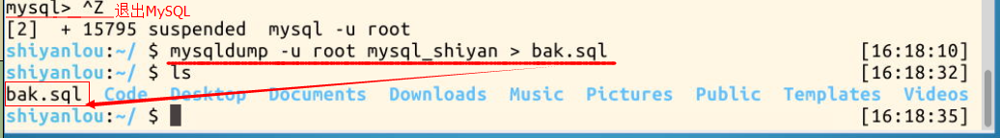

#### C3.5 备份

2022年3月30日18:00:34

---

数据库中的数据十分重要，出于安全性考虑，在数据库的使用中，应该注意使用备份功能。

> 备份与导出的区别：导出的文件只是保存数据库中的数据；而备份，则是把数据库的结构，包括数据、约束、索引、视图等全部另存为一个文件。

**mysqldump** 是 MySQL 用于备份数据库的实用程序。它主要产生一个 SQL 脚本文件，其中包含从头重新创建数据库所必需的命令 CREATE TABLE INSERT 等。

使用 mysqldump 备份的语句：

```bash
mysqldump -u root 数据库名>备份文件名;   #备份整个数据库

mysqldump -u root 数据库名 表名字>备份文件名;  #备份整个表
```

> mysqldump 是一个备份工具，因此该命令是在终端中执行的，而不是在 mysql 交互环境下

我们尝试备份整个数据库 `mysql_shiyan`，将备份文件命名为 `bak.sql`，先 `Ctrl+D` 退出 MySQL 控制台，再打开 Xfce 终端，在终端中输入命令：

```bash
cd /home/shiyanlou/
mysqldump -u root mysql_shiyan > bak.sql;
```

使用命令 “ls” 可见已经生成备份文件 `bak.sql`：



> 你可以用 gedit 查看备份文件的内容，可以看见里面不仅保存了数据，还有所备份的数据库的其它信息。


