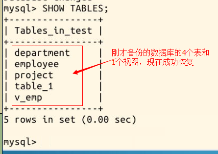
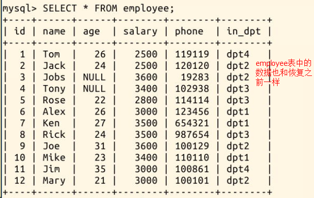

#### 3.6 恢复

2022年3月30日18:06:50

---

用备份文件恢复数据库，其实我们早就使用过了。在本次实验的开始，我们使用过这样一条命令：

```bash
source /home/shiyanlou/Desktop/MySQL-06.sql
```

这就是一条恢复语句，它把 MySQL-06.sql 文件中保存的 `mysql_shiyan` 数据库恢复。

还有另一种方式恢复数据库，但是在这之前我们先使用命令新建一个**空的数据库 test**：

```bash
mysql -u root          #因为在上一步已经退出了 MySQL，现在需要重新登录
CREATE DATABASE test;  #新建一个名为test的数据库
```

再次 **Ctrl+D** 退出 MySQL，然后输入语句进行恢复，把刚才备份的 **bak.sql** 恢复到 **test** 数据库：

```bash
mysql -u root test < bak.sql
```

我们输入命令查看 test 数据库的表，便可验证是否恢复成功：

```bash
mysql -u root  # 因为在上一步已经退出了 MySQL，现在需要重新登录
use test  # 连接数据库 test

SHOW TABLES;  # 查看 test 数据库的表
```

可以看见原数据库的 4 张表和 1 个视图，现在已经恢复到 test 数据库中：



再查看 employee 表的恢复情况：

