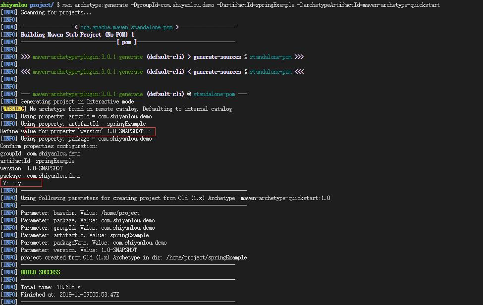

####  创建 Maven 工程

首先在 WEB IDE 顶部，选择 Terminal -> New Terminal，


在终端中输入：

```bash
mvn archetype:generate -DgroupId=com.shiyanlou.demo -DartifactId=springExample -DarchetypeArtifactId=maven-archetype-quickstart
```

在我的远程ubuntu20.04 要这样

```

mvn archetype:generate -DgroupId=com.cyf -DartifactId=cms -DarchetypeArtifactId=maven-archetype-webapp -DarchetypeCatalog=internal

```

参数说明：

- Group Id：项目的组织机构，也是包的目录结构，一般都是域名的倒序，比如 `com.shiyanlou.demo`。
- Artifact Id：项目实际的名字，比如 `springExample`。
- archetype Artifact Id：使用的 maven 骨架名称。

输入命令之后，maven 会提示我们输入版本号，这里可以直接定义版本号也可以直接回车，接着 maven 会提示当前要创建项目的基本信息，输入 y 然后回车确认。



然后我们选择 File -> Open Workspace 切换工作空间，选择 `springExample` 目录，**必须切换到该目录下，否则识别不了项目**。


代码编写


#### 创建 pom.xml

打开项目的 pom.xml，添加 Spring 依赖。

```xml
<?xml version = "1.0" encoding = "UTF-8"?>
<project xmlns = "http://maven.apache.org/POM/4.0.0" xmlns:xsi = "http://www.w3.org/2001/XMLSchema-instance"
         xsi:schemaLocation = "http://maven.apache.org/POM/4.0.0 http://maven.apache.org/xsd/maven-4.0.0.xsd">
    <modelVersion>4.0.0</modelVersion>

    <groupId>com.shiyanlou</groupId>
    <artifactId>springExample</artifactId>
    <version>1.0-SNAPSHOT</version>

    <name>springExample</name>

    <properties>
        <project.build.sourceEncoding>UTF-8</project.build.sourceEncoding>
        <maven.compiler.source>1.8</maven.compiler.source>
        <maven.compiler.target>1.8</maven.compiler.target>
        <spring.version>5.1.1.RELEASE</spring.version>

    </properties>

    <dependencies>
        <dependency>
            <groupId>org.springframework</groupId>
            <artifactId>spring-core</artifactId>
            <version>${spring.version}</version>
        </dependency>
        <dependency>
            <groupId>org.springframework</groupId>
            <artifactId>spring-context</artifactId>
            <version>${spring.version}</version>
        </dependency>
        <dependency>
            <groupId>junit</groupId>
            <artifactId>junit</artifactId>
            <version>3.8.1</version>
            <scope>test</scope>
        </dependency>
    </dependencies>
</project>
```

实际上，Maven 使用以上配置来唯一指定一个项目。引用一个库文件也是通过以上配置来确定所引用的库及其版本号，比如本例引用 Spring 库版本为 5.1.1.RELEASE。

#### 创建 HelloWorld.java

接下来，我们在 `src/main/java` 目录中创建一个 Spring bean，首先创建一个包，包名为 `com.shiyanlou.demo.helloworld`，再在该包内创建一个类，类名为 HelloWorld，并将 HelloWorld.java 编辑如下：

```java
package com.shiyanlou.demo.helloworld;

public class HelloWorld{

  private String name;

  public void setName(String n){
    this.name = n;
  }

  public void printHello(){
    System.out.println("The first Spring :hello"+name);
  }
}
```

#### 创建 SpringBeans.xml

我们先在 `src/main/` 下新建一个 Folder，命名为 `resources`，现在可以开始创建 Spring Bean 配置文件，创建文件 SpringBeans.xml，配置 bean 如下。文件位于 `src/main/resources` 下。

编辑 SpringBeans.xml 文件如下：

```xml
<?xml version = "1.0" encoding = "UTF-8"?>
<beans xmlns = "http://www.springframework.org/schema/beans"
       xmlns:xsi = "http://www.w3.org/2001/XMLSchema-instance"
       xsi:schemaLocation = "http://www.springframework.org/schema/beans http://www.springframework.org/schema/beans/spring-beans.xsd">
    <bean id = "helloBean" class = "com.shiyanlou.demo.helloworld.HelloWorld">
        <property name = "name" value = "shiyanlou"/>
    </bean>
</beans>
```

#### 创建测试 App

在 `com.shiyanlou.demo` 包下创建一个类，类名为 App:

```java
package com.shiyanlou.demo;

import com.shiyanlou.demo.helloworld.HelloWorld;
import org.springframework.context.ApplicationContext;
import org.springframework.context.support.ClassPathXmlApplicationContext;

public class App{
  private static ApplicationContext context;

  public static void main(String[] args){
    context = new ClassPathXmlApplicationContext("SpringBeans.xml");

    HelloWorld obj = (HelloWorld) context.getBean("helloBean");
    obj.printHello();
  }
}
```

#### 作为 java application 运行

首先打开终端，使用 `mvn compile` 编译 java 程序，然后使用：

```bash
mvn compile
mvn exec:java -Dexec.mainClass="com.shiyanlou.demo.App"
```

- 这里用 maven 执行 java 程序，`-Dexec.mainClass` 参数指定 main 方法所在类。

运行结果如下：


至此，helloworld 程序便成功完成！