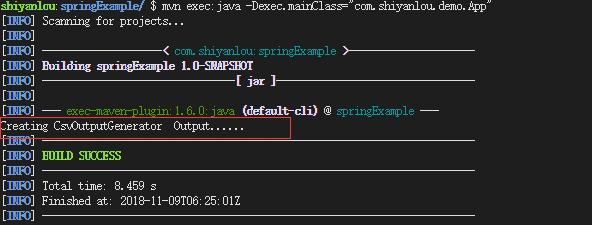
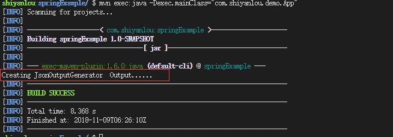

#### 松耦合代码编写


#### IOutputGenerator.java

创建 `com.shiyanlou.demo.loosely_coupled` 包，新建一个 IOutputGenerator 接口，接口内容如下：

```java
package com.shiyanlou.demo.loosely_coupled;

public interface IOutputGenerator{
  public void generateOutput();
}
```


#### CsvOutputGenerator.java


CSV 输出，实现了 IOutputGenerator 接口。同样的包路径，新建一个 CsvOutputGenerator.java。

内容如下：

```java
package com.shiyanlou.demo.loosely_coupled;

public class CsvOutputGenerator implements IOutputGenerator{

  public void generateOutput(){
    System.out.println("Creating CsvOutputGenerator  Output......");
  }

}
```


#### JsonOutputGenerator.java

JSON 输出，实现了 IOutputGenerator 接口。同样的包路径，新建一个 JsonOutputGenerator.java。 内容如下：

```java
package com.shiyanlou.demo.loosely_coupled;

public class JsonOutputGenerator implements IOutputGenerator{

  public void generateOutput(){
    System.out.println("Creating JsonOutputGenerator  Output......");
  }

}
```


#### 用 Spring 依赖注入调用输出


用 Spring 的松耦合实现输出相应的格式。 首先在 `com.shiyanlou.demo.loosely_coupled` 包内创建一个需要用到输出的类 OutputHelper.java，内容如下：

```java
package com.shiyanlou.demo.loosely_coupled;

public class OutputHelper{
  IOutputGenerator outputGenerator;

  public void generateOutput(){
    this.outputGenerator.generateOutput();
  }

  public void setOutputGenerator(IOutputGenerator outputGenerator){
    this.outputGenerator = outputGenerator;
  }
}
```


#### 创建一个 spring 配置文件


此文件用于依赖管理 `src/main/resources` 下创建配置文件 Spring-Output.xml。

```xml
    <bean id = "OutputHelper" class = "com.shiyanlou.demo.loosely_coupled.OutputHelper">
        <property name = "outputGenerator" ref = "CsvOutputGenerator" />
    </bean>
    <bean id = "CsvOutputGenerator" class = "com.shiyanlou.demo.loosely_coupled.CsvOutputGenerator" />
    <bean id = "JsonOutputGenerator" class = "com.shiyanlou.demo.loosely_coupled.JsonOutputGenerator" />
</beans>
```


#### App.java


修改此文件用于通过 Spring 调用相应的 output，内容如下：

```java
package com.shiyanlou.demo;

import org.springframework.context.ApplicationContext;
import org.springframework.context.support.ClassPathXmlApplicationContext;

import com.shiyanlou.demo.loosely_coupled.OutputHelper;

public class App{

  private static ApplicationContext context;

  public static void main( String[] args ){
    context = new ClassPathXmlApplicationContext(new String[] {"Spring-Output.xml"});

    OutputHelper output = (OutputHelper)context.getBean("OutputHelper");
    output.generateOutput();
  }
}
```

现在已经实现了松耦合，当需要输出改变时，不必修改任何代码 .java 文件，只要修改 Spring-Output.xml 文件 `<property name = "outputGenerator" ref = "CsvOutputGenerator" />` 中的 ref 值，就可以实现输出不同的内容，不修改代码就减少了出错的可能性。

当 Spring-Output 如下时：

```xml
 <bean id = "OutputHelper" class = "com.shiyanlou.demo.loosely_coupled.OutputHelper">
        <property name = "outputGenerator" ref = "CsvOutputGenerator" />
 </bean>
```

运行结果为：



当 Spring-Output 如下时：

```xml
 <bean id = "OutputHelper" class = "com.shiyanlou.demo.loosely_coupled.OutputHelper">
        <property name = "outputGenerator" ref = "JsonOutputGenerator" />
 </bean>
```

运行结果为：




#### 实验总结

本节介绍了 HelloWorld 的 spring 简单项目，并简单介绍了松耦合的概念。下一节我们将进入 IoC 容器的学习。