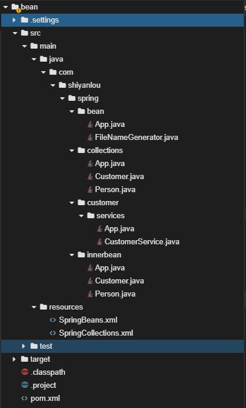

## IOC容器—–Spring核心

2022年5月16日15:42:18

---

### IOC ( Inversion of Control) 一种设计思想, 别找我们, 我们找你

用户在使用 Spring 所提供的各种功能之前，必须在 Spring IoC 容器中装配好 Bean，并建立 Bean 和 Bean 之间的关联关系。本节实验将带你学习 Spring 的 IoC 容器。

#### 知识点

- IoC 容器
- Bean 属性注入 value
- 内部嵌套的 Bean
- 集合类型的 Bean
- Bean 的作用域
- Spring 注解的配置
- Spring Bean 的生命周期

#### 项目文件结构



接下来我们看学习 Spring 最关键的部分 IOC 容器。

---

#### IoC 是什么

Ioc，Inversion of Control，即“控制反转”。它不是什么技术，**而是一种设计思想。**在 Java 开发中，Ioc 意味着将你设计好的对象交给容器控制，而不是传统的在你的对象内部直接控制。如何理解好 Ioc 呢？理解好 Ioc 的关键是要明确“**谁控制谁，控制什么，为何是反转（有反转就应该有正转了），哪些方面反转了**”，那我们来深入分析一下：

- 谁控制谁，控制什么：传统 Java SE 程序设计，我们直接在对象内部通过 new 进行创建对象，是程序主动去创建依赖对象；而 IoC 是有专门一个容器来创建这些对象，即由 IoC 容器来控制对象的创建；谁控制谁？当然是 IoC 容器控制了对象；控制什么？那就是**主要控制了外部资源获取**（不只是对象，还包括文件等）。
- 为何是反转，哪些方面反转了：有反转就有正转，传统应用程序是由我们自己在对象中主动控制去直接获取依赖对象，也就是正转；而反转则是由容器来帮忙创建及注入依赖对象；**为何是反转？因为由容器帮我们查找及注入依赖对象，对象只是被动的接受依赖对象，所以是反转**；哪些方面反转了？依赖对象的获取被反转了。

> 这里的主动获取依赖对象是不是
>
> helpGenerator = new xmlgenerrator();
>
> 更改,
>
> helpGenrator = new javagennerator();子类扩展为父类,这里需要手动更改依赖

用图例说明一下，传统程序设计都是主动去创建相关对象然后再组合起来：


当有了 IoC/DI 的容器后，在客户端类中不再主动去创建这些对象了，如图：


#### IoC 能做什么

IoC 不是一种技术，只是一种思想，一个重要的面向对象编程的法则，它能指导我们如何设计出松耦合、更优良的程序。**传统应用程序都是由我们在类内部主动创建依赖对象，从而导致类与类之间高耦合，难于测试；有了 IoC 容器后，把创建和查找依赖对象的控制权交给了容器，由容器进行注入组合对象，所以对象与对象之间是松散耦合，这样也方便测试，利于功能复用，更重要的是使得程序的整个体系结构变得非常灵活。**

其实 IoC 对编程带来的最大改变不是从代码上，而是从思想上，发生了“主从换位”的变化。应用程序原本是老大，要获取什么资源都是主动出击，但是在 IoC/DI 思想中，应用程序就变成被动的了，被动的等待 IoC 容器来创建并注入它所需要的资源了。

IoC 很好的体现了面向对象设计法则之一的好莱坞法则：“别找我们，我们找你”。即由 IoC 容器帮对象找相应的依赖对象并注入，而不是由对象主动去找。

#### IoC 和 DI

DI，Dependency Injection，即“依赖注入”：是组件之间依赖关系由容器在运行期决定，形象的说，**即由容器动态的将某个依赖关系注入到组件之中**。依赖注入的目的并非为软件系统带来更多功能，而是为了提升组件重用的频率，并为系统搭建一个灵活、可扩展的平台。通过依赖注入机制，我们只需要通过简单的配置，而无需任何代码就可指定目标需要的资源，完成自身的业务逻辑，而不需要关心具体的资源来自何处，由谁实现。

理解 DI 的关键是：“谁依赖谁，为什么需要依赖，谁注入谁，注入了什么”。我们来深入分析一下：

- 谁依赖于谁：当然是某个容器管理对象依赖于 IoC 容器；“被注入对象的对象”依赖于“依赖对象”。
- 为什么需要依赖：容器管理对象需要 IoC 容器来提供对象需要的外部资源。
- 谁注入谁：很明显是 IoC 容器注入某个对象，也就是注入“依赖对象”。
- 注入了什么：就是注入某个对象所需要的外部资源，包括对象、资源、常量数据。

IoC 和 DI 有什么关系呢？其实它们是同一个概念的不同角度描述，由于控制反转概念比较含糊（可能只是理解为容器控制对象这一个层面，很难让人想到谁来维护对象关系），所以 2004 年大师级人物 Martin Fowler 又给出了一个新的名字：“依赖注入”，相对 IoC 而言，“依赖注入”明确描述了“**被注入对象依赖 IoC 容器配置依赖对象**”。

### IoC 容器

IoC 容器就是具有依赖注入功能的容器，IoC 容器负责实例化、定位、配置应用程序中的对象及建立这些对象间的依赖。应用程序无需直接在代码中 new 相关的对象，应用程序由 IoC 容器进行组装。在 Spring 中 BeanFactory 是 IoC 容器的实际代表者。

#### Spring IoC 容器如何知道哪些是它管理的对象呢？ 

配置文件登场

> 这就需要配置文件，Spring IoC 容器通过读取配置文件中的配置**元数据**，通过元数据对应用中的各个对象进行实例化及装配。一般使用基于 xml 配置文件进行配置元数据，而且 Spring 与配置文件完全解耦的，可以使用其他任何可能的方式进行配置元数据，比如注解、基于 java 文件的、基于属性文件的配置都可以。

> 在 Spring Ioc 容器的代表就是 org.springframework.beans 包中的 BeanFactory 接口，**BeanFactory 接口提供了 IoC 容器最基本功能**；而 org.springframework.context 包下的 ApplicationContext 接口扩展了 BeanFactory，还提供了与 Spring AOP 集成、国际化处理、事件传播及提供不同层次的 context 实现，如针对 web 应用的 WebApplicationContext。简单说，BeanFactory 提供了 IoC 容器最基本功能，而 ApplicationContext 则增加了更多支持企业级功能支持。ApplicationContext 完全继承 BeanFactory，因而 BeanFactory 所具有的语义也适用于 ApplicationContext。

- XmlBeanFactory：BeanFactory 实现，提供基本的 IoC 容器功能，可以从 classpat h 或文件系统等获取资源。

  ```bash
  Resource resource = new ClassPathResource("classpath.xml");
  BeanFactory beanFactory = new XmlBeanFactory(resource);
  ```

- ClassPathXmlApplicationContext：ApplicationContext 实现，从 classpath 获取配置文件。

- FileSystemXmlApplicationContext：ApplicationContext 实现，从文件系统获取配置文件。

- AnnotationConfigApplicationContext(AppConfig.class);   从注解中获取配置文件

---

