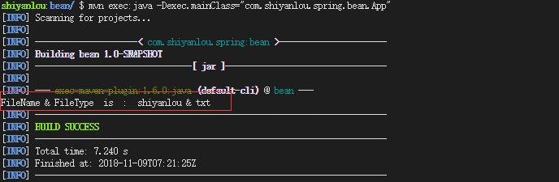

# 注册Spring_Bean的三种方式

我们如何告知IOC容器要管理那些Bean？ 以及告知如何注入依赖。

----

### 知识点

#### Spring 中bean 的定义有三种方式：

1. 基于 XML 的配置
2. 基于注解的配置
3. 基于 Java 类的配置 （一般用与第三方类）

#### Bean 的注入有两种方式：

1. ~~基于构造函数的依赖注入~~
2. 基于设值函数的依赖注入。


#### 1. 基于 XML 的配置方法(最常用)

基于 XML 的配置方法又分为三种写法：一般方法，缩写方法，pschema 方法。先看下面的 Bean：FileNameGenerator.java，其中包含两个 properties，name 和 type，我们向两个 properties 注入 value。

在 `src/main/java` 路径下，新建类：FileNameGenerator.java，所属包为：`com.shiyanlou.spring.bean`，内容为：

```java
package com.shiyanlou.spring.bean;

public class FileNameGenerator {
    private String name;
    private String type;

    public String getName() {
        return name;
    }
    public void setName(String name) {
        this.name = name;
    }
    public String getType() {
        return type;
    }
    public void setType(String type) {
       this.type = type;
    }
    /*
    *打印文件名和文件类型的方法
    */
    public void printFileName() {
        System.out.println("FileName & FileType  is  :  "+name+" & "+type);
    }
}
```

我们先在 `src/main/` 下新建一个 Folder，命名为 `resources`，接着在 `src/main/resources` 路径下新建 SpringBeans.xml 文件：

```xml
<?xml version = "1.0" encoding = "UTF-8"?>
<beans xmlns = "http://www.springframework.org/schema/beans"
       xmlns:xsi = "http://www.w3.org/2001/XMLSchema-instance"
       xsi:schemaLocation = "http://www.springframework.org/schema/beans http://www.springframework.org/schema/beans/spring-beans.xsd">
    <!--一般方法-->
    <bean id = "FileNameGenerator" class = "com.shiyanlou.spring.bean.FileNameGenerator">
        <property name = "name">
            <value>shiyanlou</value>
        </property>
        <property name = "type">
            <value>txt</value>
        </property>
    </bean>
    <!-- 另一种配置方法 缩写方法-->
    <!--
        <bean id = "FileNameGenerator" class = "com.shiyanlou.spring.bean.FileNameGenerator">
               <property name = "name" value = "shiyanlou" />
               <property name = "type" value = "txt" />
           </bean>
     -->
</beans>
```

第三种方法：pschema 方法。

```xml
<bean id = "FileNameGenerator" class = "com.shiyanlou.spring.bean.FileNameGenerator"
             p:name = "shiyanlou" p:type = "txt" />
</beans>
```

注意，这种方法需要在 bean 的配置文件 xml 中，加入声明。

```bash
xmlns:p = "http://www.springframework.org/schema/p"
```

最后需要在 `com.shiyanlou.spring.bean` 路径下写一个 App.java。

```java
package com.shiyanlou.spring.bean;

import org.springframework.context.ApplicationContext;
import org.springframework.context.support.ClassPathXmlApplicationContext;

import com.shiyanlou.spring.bean.FileNameGenerator;

public class App
{
    private static ApplicationContext context;
	
        public static void main( String[] args ) {
            // 根据xml 获取ApplicationContext which is BeanFactory's subClass. 
            context = new ClassPathXmlApplicationContext("SpringBeans.xml");
            // If We have  ApplicationContext we can get Bean
            FileNameGenerator obj = (FileNameGenerator) context.getBean("FileNameGenerator");
            obj.printFileName();
        }
}
```

运行结果如下：



#### 2. 基于注解的配置

注解是为 Spring 容器提供 Bean 定义的信息，把 XML 定义的信息通过类注解描述出来。众所周知，Spring 容器三大要素：Bean 定义、Bean 实现类以及 Spring 框架。如果采用 XML 配置，Bean 定义和 Bean 实现类本身分离，而采用注解配置，Bean 定义在 Bean 实现类上注解就可以实现。在后面我们会有一节实验专门讲解基于注解的配置，以下先简单列举几个注解方式。

#### @Component

被此注解标注的类将被 Spring 容器自动识别，自动生成 Bean 定义。即：

```java
packeage com.shiyanlou.spring;

@Component("shiyanlou")
public class shiyanlou{

}
```

与在 XML 中配置以下效果相同：

```bash
<bean id = "shiyanlou" class = "com.shiyanlou.spring.shiyanlou">
```

除此之外，Spring 有三个与 @Component 等效的注解：

1. @Controller：对应表现层的 Bean，也就是 Action。
2. @Service：对应的是业务层 Bean。
3. @Repository：对应数据访问层 Bean。

#### @Autowired  

@Autowired 可以用来装配 bean，都可以写在字段上，或者方法上。使用 @Autowired，首先要在在 applicationContext.xml 中加入 `<bean class = "org.springframework.beans.factory.annotation.AutowiredAnnotationBeanPostProcessor"/>`         @Autowired 默认按类型装配，默认情况下要求依赖对象必须存在，如果要允许 null 值，可以设置它的 required 属性为 false。例如：

```bash
@Autowired()
@Qualifier("shiyanlouDao")
private ShiyanlouDao shiyanlouDao;
```

#### 3. 基于java类 Configuration

通过使用注释 @Configuration 告诉 Spring，这个 Class 是 Spring 的核心配置文件，并且通过使用注解 @Bean 定义 bean，举例说明：

```java
package com.shiyanlou.spring.java_config;

import org.springframework.context.annotation.Bean;
import org.springframework.context.annotation.Configuration;

@Configuration
public class AppConfig {

    @Bean(name = "animal")
    public IAnimal getAnimal(){
        return new Dog();
    }
}
```

如果每个Bean 都要这么写的话，需要写许多，Spring应当提供了自动扫描机制。符合扫描规则的类都是Bean;

App.java 内容：

```java
package com.shiyanlou.spring.java_config;

import org.springframework.context.ApplicationContext;
import org.springframework.context.annotation.AnnotationConfigApplicationContext;

public class App {

    private static ApplicationContext context;

    public static void main(String[] args) {
        context = new AnnotationConfigApplicationContext(AppConfig.class);
        IAnimal obj = (IAnimal) context.getBean("animal");
        obj.makeSound();

    }

}
```

通过上面的 @Configuration 注解，相当于在 ApplicationContext.xml 文件中添加如下配置，使用了 @Configuration + @Bean 就不需要添加了：

```xml
<bean id = "animal" class = "com.shiyanlou.spring.java_config.Dog">
```

