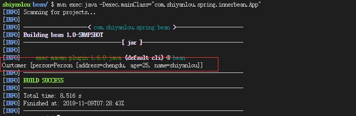

#### Spring Inner Bean - 内部嵌套的 Bean


以下 Demo 演示了一个 Bean 中嵌套了另一个 Bean，即所谓的内部嵌套 Bean 的配置方法，内部嵌套的 Bean 支持属性（property）注入和构造函数（constructor - arg）注入。

由于只是简单地知识点讲解，所以我们继续使用上面的项目。

#### 编写 Person.java

在 Src/main/java 路径下创建包 `com.shiyanlou.spring.innerbean`，并在包内创建类 Person.java。

内容如下：

```java
package com.shiyanlou.spring.innerbean;

public class Person {
    private String name;
    private String address;
    private int age;

    public String getName() {
        return name;
    }

    public void setName(String name) {
        this.name = name;
    }

    public String getAddress() {
        return address;
    }

    public void setAddress(String address) {
        this.address = address;
    }

    public int getAge() {
        return age;
    }

    public void setAge(int age) {
        this.age = age;
    }

    @Override
    public String toString() {
        return "Person [address=" + address + ", age=" + age + ", name=" + name + "]";
    }
}
```

#### 编写 Customer.java

在包 `com.shiyanlou.spring.innerbean` 下新建类 Customer.java 内容如下：

```java
package com.shiyanlou.spring.innerbean;

public class Customer {
         private Person person;
        // 带参构造方法
        public Customer(Person person) {
            this.person = person;
        }
        // 有带参构造方法一定要有默认构造方法
        public Customer(){}

        public void setPerson(Person person) {
            this.person = person;
        }

        @Override
        public String toString() {
            return "Customer [person=" + person + "]";
        }
}
```

#### 编写 SpringBeans.xml

接下来配置 Bean，配置 Bean 时，要在 Customer 的 Bean 中注入内部 Bean，即 Person。三种方法：

1. 在 Customer 中，可以用 `ref` 属性引用 Person 的 Bean，如下：

```xml
    <bean id = "CustomerBean" class = "com.shiyanlou.spring.innerbean.Customer">
        <property name = "person" ref = "PersonBean" />
    </bean>

    <bean id = "PersonBean" class = "com.shiyanlou.spring.innerbean.Person">
        <property name = "name" value = "shiyanlou" />
        <property name = "address" value = "chengdu" />
        <property name = "age" value = "25" />
    </bean>
```

以上方法利用 `ref` 很好的引用了 Person，但是，一旦 Person 被用在 Customer 下，也就不会被别的 Bean 引用。

1. 最好的方法就是在 Customer 的 Bean 中声明一个内部 Bean，如下:

```xml
 <bean id = "CustomerBean" class = "com.shiyanlou.spring.innerbean.Customer">
        <property name = "person">
            <bean class = "com.shiyanlou.spring.innerbean.Person">
                <property name = "name" value = "shiyanlou" />
                <property name = "address" value = "chengdu" />
                <property name = "age" value = "25" />
            </bean>
        </property>
  </bean>
```

1. 内部 Bean 也可以通过构造函数注入：

```xml
 <bean id = "CustomerBean" class = "com.shiyanlou.spring.innerbean.Customer">
     <constructor-arg>
         <bean class = "com.shiyanlou.spring.innerbean.Person">
             <property name = "name" value = "shiyanlou" />
             <property name = "address" value = "chengdu" />
             <property name = "age" value = "25" />
         </bean>
     </constructor-arg>
 </bean>
```

#### 编写 App.java

接下来，我们在 `com.shiyanlou.spring.innerbean` 包下面创建 App.java 进行测试。内容如下：

```java
package com.shiyanlou.spring.innerbean;

import org.springframework.context.ApplicationContext;
import org.springframework.context.support.ClassPathXmlApplicationContext;

import com.shiyanlou.spring.innerbean.Customer;

public class App
{
    private static ApplicationContext context;

        public static void main( String[] args )
        {
            context = new ClassPathXmlApplicationContext("SpringBeans.xml");

            Customer obj = (Customer) context.getBean("CustomerBean");

            System.out.println(obj.toString());
        }
}
```

#### 运行

```bash
mvn compile
mvn exec:java -Dexec.mainClass="com.shiyanlou.spring.innerbean.App"
```

成功显示：




