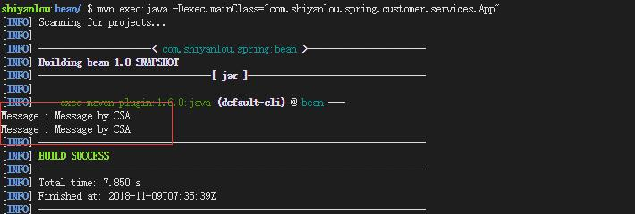
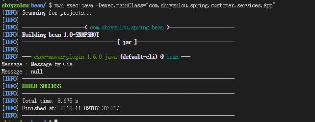

#### Spring Bean Scopes - Bean 的作用域


在 Spring 中，Bean 的作用域决定了从 Spring 容器中返回的 Bean 实例的类型。在 Spring 中，支持以下 5 种类型的作用域：

1. singleton — 单例模式，由 IOC 容器返回一个唯一的 bean 实例。
2. prototype — 原型模式，被请求时，每次返回一个新的 bean 实例。
3. request — 每个 HTTP Request 请求返回一个唯一的 Bean 实例。
4. session — 每个 HTTP Session 返回一个唯一的 Bean 实例。
5. globalSession — Http Session 全局 Bean 实例。

> 注：大多数情况下，你可能只需要处理 Spring 的核心作用域 — 单例模式（singleton）和原型模式（prototype），默认情况下，作用域是单例模式。

#### singleton 和 prototype 区别

继续使用原来的项目，在 `src/main/java` 路径下，新建包：`com.shiyanlou.spring.customer.services`，新建类 CustomerService.java 如下:

```java
package com.shiyanlou.spring.customer.services;

public class CustomerService
{
    String message;

    public String getMessage() {
        return message;
    }

    public void setMessage(String message) {
        this.message = message;
    }
}
```

1). 如果是 singleton 情况下的 SpringBeans.xml 配置如下:

```xml
<bean id = "CustomerService"  class = "com.shiyanlou.spring.customer.services.CustomerService" />
```

以上配置中，如果没有指定 scope 范围，默认情况下是 singleton 模式。

2). Prototype 情况下的配置如下：

```xml
<bean id = "CustomerService" class = "com.shiyanlou.spring.customer.services.CustomerService" scope = "prototype"/>
```

然后，在路径 `com.shiyanlou.spring.customer.services` 下创建 App.java，内容如下：

```java
package com.shiyanlou.spring.customer.services;

import org.springframework.context.ApplicationContext;
import org.springframework.context.support.ClassPathXmlApplicationContext;

public class App
{
     private static ApplicationContext context;

        public static void main( String[] args )
        {
            context = new ClassPathXmlApplicationContext(new String[] {"SpringBeans.xml"});

            CustomerService CSA = (CustomerService) context.getBean("CustomerService");
            CSA.setMessage("Message by CSA");
            System.out.println("Message : "+ CSA.getMessage());

            //retrieve it again
            CustomerService CSB = (CustomerService) context.getBean("CustomerService");
            System.out.println("Message : "+ CSB.getMessage());
        }
}
```

运行:

```bash
mvn compile
mvn exec:java -Dexec.mainClass="com.shiyanlou.spring.customer.services.App"
```

实验结果如下：

1). singleton 情况:



2). Prototype 情况:



由此可知，设置 scope 为 prototype 后，测试代码中，每调用一次 getBean() 方法后，都会得到一个新的实例。