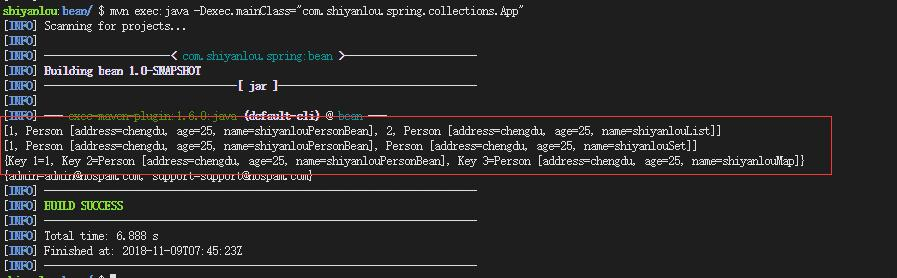

Spring Collections - 集合类型的 Bean

下面讲怎样将值注入集合类型，包含以下四种主要的集合类型：

- List
- Set
- Map
- Properties

#### 编写 Person.java && Customer.java

仍旧使用原项目，创建一个包：`com.shiyanlou.spring.collections`，直接拷贝上一个小实验的 Person 类到刚创建的 collections 包下即可。然后创建一个 Customer.java，内容如下：

```java
package com.shiyanlou.spring.collections;

import java.util.*;

import com.shiyanlou.spring.innerbean.Person;

public class Customer {

    private List<Object> lists; // 这里的 lists 要和 Bean 中 property 标签的 name 一样。详见本段代码下的注释。
    private Set<Object> sets ;
    private Map<Object, Object> maps ;
    private Properties pros;

    public List<Object> getLists() {
        return lists;
    }
    public void setLists(List<Object> lists) {
        this.lists = lists;
    }
    public Set<Object> getSets() {
        return sets;
    }
    public void setSets(Set<Object> sets) {
        this.sets = sets;
    }
    public Map<Object, Object> getMaps() {
        return maps;
    }
    public void setMaps(Map<Object, Object> maps) {
        this.maps = maps;
    }
    public Properties getPros() {
        return pros;
    }
    public void setPros(Properties pros) {
        this.pros = pros;
    }

    private Person person; // 不要忘记写内部要引用的 Bean

    public Customer(Person person) {
        this.person = person;
    }

    public Customer(){}

    public void setPerson(Person person) {
        this.person = person;
    }

    @Override
    public String toString() {
        return "Customer [person=" + person + "]";
    }
}
```

> 注意：JavaBean 关于属性命名的特殊规范，Spring 配置文件中 `<property>` 元素所指定的属性名和 Bean 实现类的 Setter 方法满足 Sun JavaBean 的属性命名规范：xxx 的属性对应 setxxx() 方法。一般情况下 Java 的属性变量名都以小写字母起头，如：maxSpeed。但也存在特殊的情况，考虑到一些特定意义的大写英文缩略词（如：USA、XML），JavaBean 也允许大写字母起头的属性变量名，不过必须满足: 变量的前两个字母要么全部大写，要么全部小写。如：iC、iCcard、iDcode 这些都不合法的。

#### 编写 SpringCollections.xml

在 `src/main/resources` 下创建配置文件 SpringCollections.xml。具体代码如下，配合注释理解：

```xml
<?xml version = "1.0" encoding = "UTF-8"?>
<beans xmlns = "http://www.springframework.org/schema/beans"
    xmlns:xsi = "http://www.w3.org/2001/XMLSchema-instance"
    xsi:schemaLocation = "http://www.springframework.org/schema/beans
    http://www.springframework.org/schema/beans/spring-beans.xsd">

    <!--bean的 id 最好首字母小写 -->
    <bean id = "customerBean" class = "com.shiyanlou.spring.collections.Customer">

        <!-- java.util.List -->
        <property name = "lists">
            <list>
                <value>1</value>
                <!-- List 属性既可以通过 <value> 注入字符串，也可以通过 <ref> 注入容器中其他的 Bean-->
                 <ref bean = "personBean" />
                 <value>2</value>
                <bean class = "com.shiyanlou.spring.collections.Person">
                    <property name = "name" value = "shiyanlouList" />
                    <property name = "address" value = "chengdu" />
                    <property name = "age" value="25" />
                </bean>
            </list>
        </property>

        <!-- java.util.Set -->
        <property name = "sets">
            <set>
                <value>1</value><!--Set 与 List 类似-->
                <ref bean = "personBean" />
                <bean class = "com.shiyanlou.spring.collections.Person">
                    <property name = "name" value = "shiyanlouSet" />
                    <property name = "address" value = "chengdu" />
                    <property name = "age" value = "25" />
                </bean>
            </set>
        </property>

        <!-- java.util.Map -->
        <property name = "maps">
            <map>
                <entry key = "Key 1" value = "1" />
                <!--一个 entry 就是一个 Map 元素-->
                <entry key = "Key 2" value-ref = "personBean" />
                <entry key = "Key 3">
                    <bean class = "com.shiyanlou.spring.collections.Person">
                        <property name = "name" value = "shiyanlouMap" />
                           <property name = "address" value = "chengdu" />
                        <property name = "age" value = "25" />
                    </bean>
                </entry>
            </map>
        </property>

        <!-- java.util.Properties -->
        <property name = "pros">
        <!-- Properties 类型类似于Map 类型的特例，Map 元素的键值可以对应任何类型的对象，但是Properties只能是字符串-->
            <props>
                <prop key = "admin">admin@nospam.com</prop>
                <prop key = "support">support@nospam.com</prop>
            </props>
        </property>
    </bean>

    <bean id = "personBean" class = "com.shiyanlou.spring.collections.Person">
        <property name = "name" value = "shiyanlouPersonBean" />
        <property name = "address" value = "chengdu" />
        <property name = "age" value = "25" />
    </bean>
</beans>
```

#### 编写 App.java

代码如下，详见注释：

```java
package com.shiyanlou.spring.collections;

import org.springframework.context.ApplicationContext;
import org.springframework.context.support.ClassPathXmlApplicationContext;

public class App
{
    private static ApplicationContext context;

        public static void main( String[] args )
        {
            context = new ClassPathXmlApplicationContext("SpringCollections.xml");

            /*
             * case 1 : List 第1种情况
             */
            Customer customer = (Customer) context.getBean("customerBean");
            System.out.println(customer.getLists().toString());

            /*
             * case 2 : Set 第2种情况
             */
            System.out.println(customer.getSets().toString());

            /*
             * case 3 : Map 第3种情况
             */
            System.out.println(customer.getMaps().toString());

            /*
             * case 4 : 第4种情况
             */
            System.out.println(customer.getPros().toString());


        }
}
```

#### 运行结果

运行

```bash
mvn compile
mvn exec:java -Dexec.mainClass="com.shiyanlou.spring.collections.App"
```



