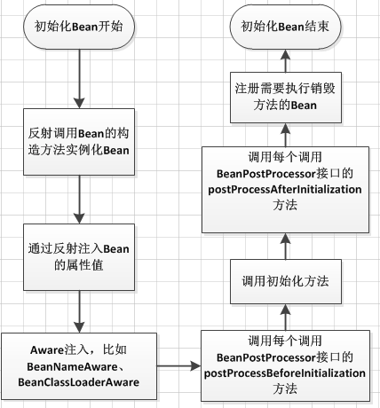

Spring Bean 的生命周期

Spring 框架中，一旦把一个 Bean 纳入 Spring IOC 容器之中，这个 Bean 的生命周期就会交由容器进行管理，一般担当管理角色的是 BeanFactory 或者 ApplicationContext，认识一下 Bean 的生命周期活动，对更好的利用它有很大的帮助：

下面以 BeanFactory 为例，说明一个 Bean 的生命周期活动

- Bean 的建立，由 BeanFactory 读取 Bean 定义文件，并生成各个实例。
- Setter 注入，执行 Bean 的属性依赖注入。
- BeanNameAware 的 `setBeanName()`，如果实现该接口，则执行其 setBeanName 方法
- BeanFactoryAware 的 `setBeanFactory()`，如果实现该接口，则执行其 setBeanFactory 方法。
- BeanPostProcessor 的 `processBeforeInitialization()`，如果有关联的 processor，则在 Bean 初始化之前都会执行这个实例的 `processBeforeInitialization()` 方法。
- InitializingBean 的 `afterPropertiesSet()`，如果实现了该接口，则执行其 `afterPropertiesSet()` 方法。
- Bean 定义文件中定义 init-method。
- BeanPostProcessors 的 `processAfterInitialization()`，如果有关联的 processor，则在 Bean 初始化之后都会执行这个实例的 `processAfterInitialization()` 方法。
- DisposableBean 的 `destroy()`，在容器关闭时，如果 Bean 类实现了该接口，则执行它的 `destroy()` 方法。
- Bean 定义文件中定义 destroy-method，在容器关闭时，可以在 Bean 定义文件中使用“destory-method”定义的方法。

如果使用 ApplicationContext 来维护一个 Bean 的生命周期，则基本上与上边的流程相同，只不过在执行 BeanNameAware 的 `setBeanName()` 后，若有 Bean 类实现了 `org.springframework.context.ApplicationContextAware` 接口，则执行其 `setApplicationContext()` 方法，然后再进行 BeanPostProcessors 的 `processBeforeInitialization()`。

实际上，ApplicationContext 除了向 BeanFactory 那样维护容器外，还提供了更加丰富的框架功能，如 Bean 的消息，事件处理机制等。

