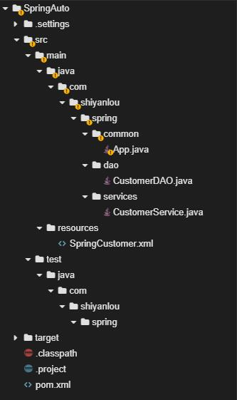
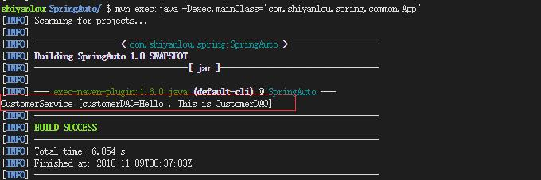

实验介绍


本节实验将带你学习 Spring 框架中的自动扫描组件与自动装配相关知识点。

#### 知识点

- 自动扫描组件
- 自动装配 Bean

#### 实验环境

- JDK
- Web IDE

项目文件结构





自动扫描组件


通常你可以在 xml 配置文件中，声明一个 bean 或者 component，然后 Spring 容器会检查和注册你的 bean 或 component。

实际上，Spring 支持自动扫描 bean 或 component，你可以不必再在 xml 文件中繁琐的声明 bean，Spring 会自动扫描并检查你指定包的 bean 或 component。以下列举一个简单的 Spring Project，包含了 Controller、Service、DAO 层，由此分析下手动配置和自动扫描的不同。

首先创建一个新的 maven 工程 `SpringAuto`，打开 Terminal，选择 File->Open New Terminal，在终端中输入：

```bash
mvn archetype:generate -DgroupId=com.shiyanlou.spring -DartifactId=SpringAuto -DarchetypeArtifactId=maven-archetype-quickstart
```

选择 File->Open Workspace 切换工作空间，选择 `SpringAuto` 目录，**必须切换到该目录下，否则识别不了项目**。

修改 pom.xml 文件，添加 Spring 的依赖：

```xml
<?xml version = "1.0" encoding = "UTF-8"?>
<project xmlns = "http://maven.apache.org/POM/4.0.0" xmlns:xsi = "http://www.w3.org/2001/XMLSchema-instance"
         xsi:schemaLocation = "http://maven.apache.org/POM/4.0.0 http://maven.apache.org/xsd/maven-4.0.0.xsd">
    <modelVersion>4.0.0</modelVersion>

    <groupId>com.shiyanlou.spring</groupId>
    <artifactId>SpringAuto</artifactId>
    <version>1.0-SNAPSHOT</version>

    <name>SpringAuto</name>

    <properties>
        <project.build.sourceEncoding>UTF-8</project.build.sourceEncoding>
        <maven.compiler.source>1.8</maven.compiler.source>
        <maven.compiler.target>1.8</maven.compiler.target>
        <spring.version>5.1.1.RELEASE</spring.version>

    </properties>

    <dependencies>
        <dependency>
            <groupId>org.springframework</groupId>
            <artifactId>spring-core</artifactId>
            <version>${spring.version}</version>
        </dependency>
        <dependency>
            <groupId>org.springframework</groupId>
            <artifactId>spring-context</artifactId>
            <version>${spring.version}</version>
        </dependency>
    </dependencies>
</project>
```

#### 手动配置 component

先看一下正常手动配置一个 bean。

DAO 层，创建包 `com.shiyanlou.spring.dao`，创建 `CustomerDAO.java`。

内容如下：

```java
package com.shiyanlou.spring.dao;

public class CustomerDAO {
    @Override
    public String toString(){
        return "Hello , This is CustomerDAO";
    }
}
```

Service 层，创建包 `com.shiyanlou.spring.services`，创建 `CustomerService.java` 内容如下：

```java
package com.shiyanlou.spring.services;

import com.shiyanlou.spring.dao.CustomerDAO;

public class CustomerService {
    CustomerDAO customerDAO;

    public void setCustomerDAO(CustomerDAO customerDAO) {
        this.customerDAO = customerDAO;
    }

    @Override
    public String toString() {
        return "CustomerService [customerDAO = " + customerDAO + "]";
    }
}
```

在目录 `src/main/resources` 创建并配置 SpringCustomer.xml 文件：

```xml
<?xml version = "1.0" encoding = "UTF-8"?>
<beans xmlns = "http://www.springframework.org/schema/beans"
    xmlns:xsi = "http://www.w3.org/2001/XMLSchema-instance"
    xsi:schemaLocation = "http://www.springframework.org/schema/beans
    http://www.springframework.org/schema/beans/spring-beans.xsd">

    <bean id = "customerService" class = "com.shiyanlou.spring.services.CustomerService">
        <property name = "customerDAO" ref = "customerDAO" />
    </bean>

    <bean id = "customerDAO" class = "com.shiyanlou.spring.dao.CustomerDAO" />

</beans>
```

最后，创建 App.java 文件，在包路径 `com.shiyanlou.spring.common` 下。内容如下：

```java
package com.shiyanlou.spring.common;

import org.springframework.context.ApplicationContext;
import org.springframework.context.support.ClassPathXmlApplicationContext;

import com.shiyanlou.spring.services.CustomerService;

public class App {
    public static void main( String[] args ) {
        ApplicationContext context =
        new ClassPathXmlApplicationContext(new String[] {"SpringCustomer.xml"});

        CustomerService cust = (CustomerService)context.getBean("customerService");
        System.out.println(cust);

    }
}
```

运行

```bash
mvn compile
mvn exec:java -Dexec.mainClass="com.shiyanlou.spring.common.App"
```

实验结果如下：



#### 自动扫描组件

用注释 `@Component` 来表示这个 Class 是一个自动扫描组件。CustomerDAO.java 的内容如下：

```java
package com.shiyanlou.spring.dao;

import org.springframework.stereotype.Component;

@Component
public class CustomerDAO
{
    @Override
    public String toString() {
        return "Hello , This is CustomerDAO";
    }
}
```

CustomerService.java 的内容如下：

```java
package com.shiyanlou.spring.services;

import org.springframework.beans.factory.annotation.Autowired;
import org.springframework.stereotype.Component;

import com.shiyanlou.spring.dao.CustomerDAO;

@Component
public class CustomerService
{
    @Autowired
    CustomerDAO customerDAO;

    @Override
    public String toString() {
        retur    	n "CustomerService [customerDAO=" + customerDAO + "]";
    }
}
```

配置文件 SpringCustomer.xml 如下

```xml
<?xml version = "1.0" encoding = "UTF-8"?>
<beans xmlns = "http://www.springframework.org/schema/beans"
       xmlns:xsi = "http://www.w3.org/2001/XMLSchema-instance"
       xmlns:context = "http://www.springframework.org/schema/context"
       xsi:schemaLocation = "
            http://www.springframework.org/schema/context
            http://www.springframework.org/schema/context/spring-context.xsd
            http://www.springframework.org/schema/beans
            http://www.springframework.org/schema/beans/spring-beans.xsd">

    <context:component-scan base-package = "com.shiyanlou.spring"/>

</beans>
```

> 注意：以上 xml 文件中，加入了 `context:component-scan` 标签，`beans` 中也加入了标签，这样就将 Spring 的自动扫描特性引入，`base-package` 表示组件的存放位置，Spring 将扫描对应文件夹下的 bean（用 @Component 注释过的），将这些 bean 注册到容器中。

最后运行结果与手动配置的结果一致。

#### 自定义扫描组件名称

上例中，默认情况下，Spring 将把组件 Class 的第一个字母变成小写，来作为自动扫描组件的名称，例如将 `CustomerService` 转变为 `customerService`，你可以用 `customerService` 这个名字调用组件，如下：

```java
CustomerService cust = (CustomerService)context.getBean("customerService");
```

也可以像下面这样，创建自定义的组件名称：

```java
 @Service("AAA")
public class CustomerService
...
```

但是得添加下面的代码：

```java
import org.springframework.stereotype.Service;
```

可以调用自己定义的组件了，如下：

```java
CustomerService cust = (CustomerService)context.getBean("AAA");
```

#### 自动扫描组件的注释类型

有 4 种注释类型，分别是：

1. @Component —— 表示一个自动扫描 component。
2. @Repository —— 表示持久化层的 DAO component。
3. @Service —— 表示业务逻辑层的 Service component。
4. @Controller —— 表示表示层的 Controller component。

在项目中，我们可以将所有自动扫描组件都用 @Component 注释，**Spring 将会扫描所有用 @Component 注释过得组件。实际上，@Repository 、@Service 、@Controller 三种注释是为了加强代码的阅读性而创造的**，可以在不同的应用层中，用不同的注释，我们可以在上一个项目的基础上改一下注释，如下：

DAO 层：

```java
package com.shiyanlou.spring.dao;

import org.springframework.stereotype.Repository;

@Repository
public class CustomerDAO
{
    @Override
    public String toString() {
        return "Hello , This is CustomerDAO";
    }
}
```

Service 层：

```java
package com.shiyanlou.spring.services;

import org.springframework.beans.factory.annotation.Autowired;
import org.springframework.stereotype.Service;

import com.shiyanlou.spring.dao.CustomerDAO;

@Service
public class CustomerService
{
    @Autowired
    CustomerDAO customerDAO;

    @Override
    public String toString() {
        return "CustomerService [customerDAO=" + customerDAO + "]";
    }
}
```

#### 自动扫描中过滤组件

**1). Filter Component - include**

下例演示了用 “filter” 自动扫描注册组件，这些组件只要匹配定义的 “regex” 的命名规则，Class 前就不需要用 @Component 进行注释。xxx

DAO 层，CustomerDAO.java 如下:

```java
package com.shiyanlou.spring.dao;

public class CustomerDAO
{
    @Override
    public String toString() {
        return "Hello , This is CustomerDAO";
    }
}
```

Service 层，CustomerService.java 如下：

```java
package com.shiyanlou.spring.services;

import org.springframework.beans.factory.annotation.Autowired;
import com.shiyanlou.spring.dao.CustomerDAO;

public class CustomerService
{
    @Autowired
    CustomerDAO customerDAO;

    @Override
    public String toString() {
        return "CustomerService [customerDAO=" + customerDAO + "]";
    }

}
```

SpringFiltering.xml 配置如下：

```xml
 <beans xmlns = "http://www.springframework.org/schema/beans"
    xmlns:xsi = "http://www.w3.org/2001/XMLSchema-instance"
    xmlns:context = "http://www.springframework.org/schema/context"
    xsi:schemaLocation = "
            http://www.springframework.org/schema/context
            http://www.springframework.org/schema/context/spring-context.xsd
            http://www.springframework.org/schema/beans
            http://www.springframework.org/schema/beans/spring-beans.xsd">

    <context:component-scan base-package = "com.shiyanlou.spring" >

        <context:include-filter type = "regex"
                       expression = "com.shiyanlou.spring.dao.*DAO.*" />

        <context:include-filter type = "regex"
                       expression = "com.shiyanlou.spring.services.*Service.*" />

    </context:component-scan>

</beans>
```

以上 xml 文件中，所有文件名字，只要包含 DAO 和 Service（ *DAO._，_Service.* ）关键字的，都将被检查注册到 Spring 容器中。

创建 App.java 并运行如下：

```java
package com.shiyanlou.spring.common;

import org.springframework.context.ApplicationContext;
import org.springframework.context.support.ClassPathXmlApplicationContext;

import com.shiyanlou.spring.services.CustomerService;

public class App
{
    public static void main( String[] args )
    {
        ApplicationContext context =
        new ClassPathXmlApplicationContext(new String[] {"SpringFiltering.xml"});

        CustomerService cust = (CustomerService)context.getBean("customerService");
        System.out.println(cust);

    }
}
```

运行结果与之前相同。

**2). Filter Component——exclude**

也可以用 exclude，制定组件避免被 Spring 发现并被注册到容器中。以下配置排除用 @Service 注释过的组件：

```xml
<context:component-scan base-package = "com.shiyanlou.spring" >
        <context:exclude-filter type = "annotation"
            expression = "org.springframework.stereotype.Service" />
</context:component-scan>
```

以下配置排除包含 DAO 关键字的组件：

```xml
<context:component-scan base-package = "com.shiyanlou.spring" >
        <context:exclude-filter type = "regex"
            expression = "com.shiyanlou.spring.dao.*DAO.*" />
</context:component-scan>
```


#### 自动装配 Bean

**所谓自动装配，就是将一个 Bean 注入到其他 Bean 的 Property 中，类**似于以下：

```xml
<bean id = "customer" class = "com.shiyanlou.spring.autowire.common.Customer" autowire = "byName" />
```

Spring 支持 5 种自动装配模式，如下：

- no —— 默认情况下，不自动装配，通过 `ref` attribute 手动设定。
- byName —— 根据 Property 的 Name 自动装配，如果一个 bean 的 name，和另一个 bean 中的 Property 的 name 相同，则自动装配这个 bean 到 Property 中。
- byType —— 根据 Property 的数据类型（ Type ）自动装配，如果一个 bean 的数据类型，兼容另一个 bean 中 Property 的数据类型，则自动装配。
- constructor —— 根据构造函数参数的数据类型，进行 byType 模式的自动装配。
- autodetect —— 如果发现默认的构造函数，用 constructor 模式，否则，用 byType 模式。

下例中演示自动装配，CustomerService.java 如下：

```java
package com.shiyanlou.spring.services;

import com.shiyanlou.spring.dao.CustomerDAO;

public class CustomerService {
    CustomerDAO customerDAO;

    public void setCustomerDAO(CustomerDAO customerDAO) {
        this.customerDAO = customerDAO;
    }

    @Override
    public String toString() {
        return "CustomerService [customerDAO=" + customerDAO + "]";
    }

}
```

CustomerDAO.java 如下：

```java
package com.shiyanlou.spring.dao;

public class CustomerDAO {
    @Override
    public String toString(){
        return "Hello , This is CustomerDAO";
    }
}
```

#### Auto-Wiring `no`

默认情况下，需要通过 `ref` 来装配 bean ，如下：

```xml
 <bean id = "customerService" class = "com.shiyanlou.spring.services.CustomerService">
  <property name = "customerDAO" ref = "customerDAO" />
  </bean>
 <bean id = "customerDAO" class = "com.shiyanlou.spring.dao.CustomerDAO" />
```

#### Auto-Wiring `byName`

根据属性 Property 的名字装配 bean，这种情况，CustomerService 设置了 `autowire = "byName"`，Spring 会自动寻找与属性名字 `customerDAO` 相同的 bean，找到后，通过调用 `setCustomerDAO(CustomerDAO customerDAO)` 将其注入属性。

```xml
 <bean id = "customerService" class = "com.shiyanlou.spring.services.CustomerService" autowire = "byName">
 </bean>
 <bean id = "customerDAO" class = "com.shiyanlou.spring.dao.CustomerDAO" />
```

如果根据 Property name 找不到对应的 bean 配置，如下：

```xml
 <bean id = "customerService" class = "com.shiyanlou.spring.services.CustomerService" autowire = "byName">
 </bean>
 <bean id = "customerDAO_another" class = "com.shiyanlou.spring.dao.CustomerDAO" />
```

CustomerService 中 Property 名字是 customerDAO，但是配置文件中找不到 customerDAO，只有 customerDAO_another，这时就会装配失败。运行后，CustomerService 中 customerDAO = null。

#### Auto-Wiring `byType` (两个相同类型bean会报错)

根据属性 Property 的数据类型自动装配，这种情况，CustomerService 设置了 `autowire = "byType"`，Spring 会自动寻找与属性类型相同的 bean，找到后，通过调用 setCustomerDAO(CustomerDAO customerDAO) 将其注入。

```xml
 <bean id = "customerService" class = "com.shiyanlou.spring.services.CustomerService" autowire = "byType">
 </bean>
 <bean id = "customerDAO" class = "com.shiyanlou.spring.dao.CustomerDAO" />
```

**如果配置文件中有两个类型相同的 bean 会怎样呢**？如下：

```xml
 <bean id = "customerService" class = "com.shiyanlou.spring.services.CustomerService" autowire = "byType">
 </bean>
 <bean id = "customerDAO" class = "com.shiyanlou.spring.dao.CustomerDAO" />
<bean id = "customerDAO_another" class = "com.shiyanlou.spring.dao.CustomerDAO" />
```

一旦配置如上，有两种相同数据类型的 bean 被配置，将抛出 UnsatisfiedDependencyException 异常，见以下：`Exception in thread "main" org.springframework.beans.factory.UnsatisfiedDependencyException`。所以，一旦选择了 `byType` 类型的自动装配，请确认你的配置文件中每个数据类型定义一个唯一的 bean。

#### Auto-Wiring `constructor`

这种情况下，Spring 会寻找与参数数据类型相同的 bean，通过构造函数 `public Customer(Person person)` 将其注入。

```xml
 <bean id = "customerService" class = "com.shiyanlou.spring.services.CustomerService" autowire = "constructor">
 </bean>
 <bean id = "customerDAO" class = "com.shiyanlou.spring.dao.CustomerDAO" />
```

注意：项目中 autowire 结合 dependency-check 一起使用是一种很好的方法，这样能够确保属性总是可以成功注入。如下：

```xml
 <bean id = "customerService" class = "com.shiyanlou.spring.services.CustomerService" autowire = "autodetect" dependency-check = "objects">
 </bean>
 <bean id = "customerDAO" class = "com.shiyanlou.spring.dao.CustomerDAO" />
```


#### 实验总结

自动装配能够让开发变得更快速，但是同时却要花更大的力气维护。因为它增加了配置文件的复杂性，有时甚至不知道哪一个 bean 会被自动注入到另一个 bean 中。所以学好自动装配能够让今后的开发工作更高效。下一节我们将进入 AOP 之 Advice 的学习。