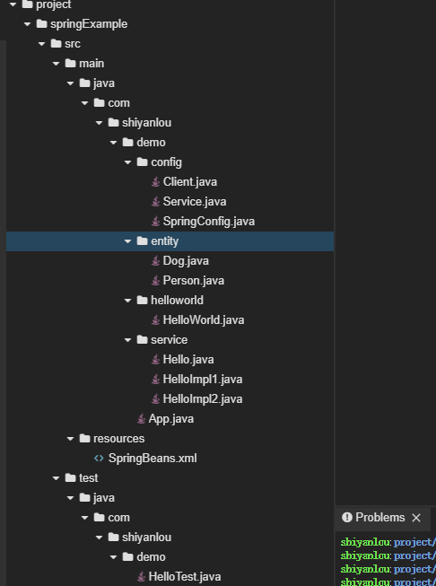
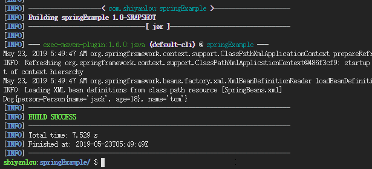
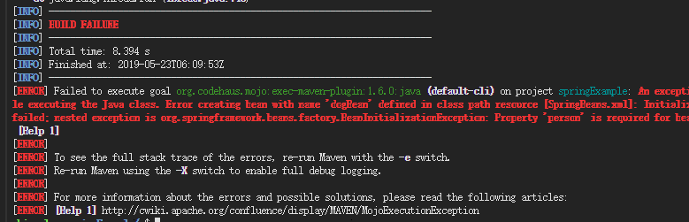
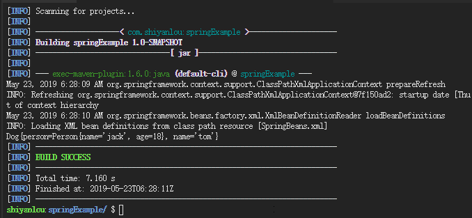
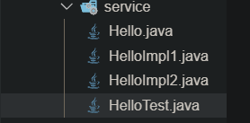
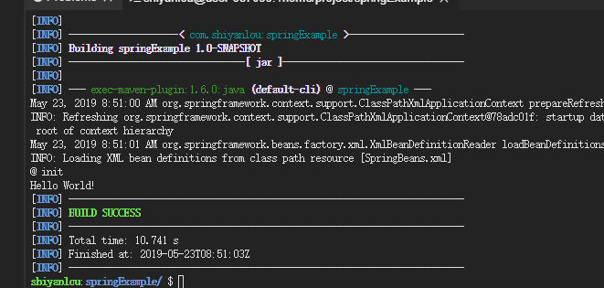
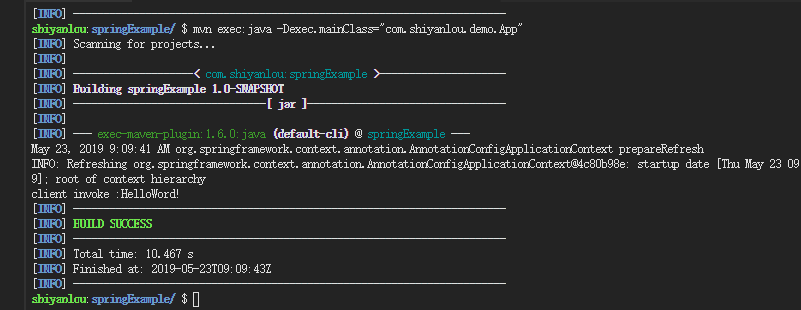

实验介绍


本节实验将带你学习 Spring 框架中基于注解的配置，基于注解的配置十分方便，这也是大家现在比较推崇的方式。

#### 知识点

- Spring @Required 注解
- Spring @Autowired 注解
- Spring @Qualifier 注解
- Spring JSR-250 注解
- Spring 基于 Java 的配置

#### 实验环境

- JDK
- Web IDE

####  获取源码

在 Terminal 中，输入：

```bash
wget https://labfile.oss.aliyuncs.com/courses/578/springExample.zip
```

然后解压：

```bash
unzip springExample.zip
```


项目文件结构




---

#### @Required 注解

Spring 依赖检查 bean 配置文件用于确定的特定类型（基本，集合或对象）的所有属性被设置。在大多数情况下，你只需要确保特定属性已经设置但不是所有属性。对于这种情况，你需要 @Required 注解。

首先创建一个新的 maven 工程 `springExample`，打开 Terminal，选择 File->Open New Terminal，在终端中输入：

```bash
mvn archetype:generate -DgroupId=com.shiyanlou.demo -DartifactId=springExample -DarchetypeArtifactId=maven-archetype-quickstart
```

选择 File->Open Workspace 切换工作空间，选择 `springExample` 目录，**必须切换到该目录下，否则识别不了项目**。

修改 pom.xml 文件，添加 Spring 的依赖：

```xml
<?xml version = "1.0" encoding = "UTF-8"?>
<project xmlns = "http://maven.apache.org/POM/4.0.0" xmlns:xsi = "http://www.w3.org/2001/XMLSchema-instance"
         xsi:schemaLocation = "http://maven.apache.org/POM/4.0.0 http://maven.apache.org/xsd/maven-4.0.0.xsd">
    <modelVersion>4.0.0</modelVersion>

    <groupId>com.shiyanlou</groupId>
    <artifactId>springExample</artifactId>
    <version>1.0-SNAPSHOT</version>

    <name>springExample</name>

    <properties>
        <project.build.sourceEncoding>UTF-8</project.build.sourceEncoding>
        <maven.compiler.source>1.8</maven.compiler.source>
        <maven.compiler.target>1.8</maven.compiler.target>
        <spring.version>4.3.20.RELEASE</spring.version>

    </properties>

    <dependencies>
        <dependency>
            <groupId>org.springframework</groupId>
            <artifactId>spring-core</artifactId>
            <version>${spring.version}</version>
        </dependency>
        <dependency>
            <groupId>org.springframework</groupId>
            <artifactId>spring-context</artifactId>
            <version>${spring.version}</version>
        </dependency>
    </dependencies>
</project>
```

创建包 `com.shiyanlou.demo.entity`，创建 `Person.java`，代码如下：

```java
package com.shiyanlou.demo.entity;

public class Person {

    private String name;
    private Integer age;

    public String getName() {
        return name;
    }

    public Integer getAge() {
        return age;
    }

    public void setName(String name) {
        this.name = name;
    }

    public void setAge(Integer age) {
        this.age = age;
    }

    @Override
    public String toString() {
        return "Person{" +
                "name='" + name + '\'' +
                ", age=" + age +
                '}';
    }
}
```

再在 `entity` 下创建 `Dog.java`，代码如下:

```java
package com.shiyanlou.demo.entity;

import org.springframework.beans.factory.annotation.Required;

public class Dog {

    private Person person;  //为什么狗类包含人类，而不是人类包含狗类呢？ 
    private String name;

    public Person getPerson() {
        return person;
    }

    public String getName() {
        return name;
    }

    public void setName(String name) {
        this.name = name;
    }

    @Required
    public void setPerson(Person person) {
        this.person = person;
    }

    @Override
    public String toString() {
        return "Dog{" +
                "person=" + person +
                ", name='" + name + '\'' +
                '}';
    }
}
```

我们先在 src/main/ 下新建一个 Folder，命名为 resources，现在可以开始创建 Spring Bean 配置文件，创建文件 SpringBeans.xml，配置 bean 如下。文件位于 src/main/resources 下。

编辑 SpringBeans.xml 文件如下：

```xml
<?xml version = "1.0" encoding = "UTF-8"?>
<beans xmlns = "http://www.springframework.org/schema/beans"
       xmlns:xsi = "http://www.w3.org/2001/XMLSchema-instance"
       xmlns:context = "http://www.springframework.org/schema/context"
       xsi:schemaLocation = "http://www.springframework.org/schema/beans http://www.springframework.org/schema/beans/spring-beans.xsd
                           http://www.springframework.org/schema/context
                           http://www.springframework.org/schema/context/spring-context.xsd">


    <context:annotation-config/>

    <bean id = "personBean" class = "com.shiyanlou.demo.entity.Person">
        <property name = "name" value = "jack"/>
        <property name = "age" value = "18"/>
    </bean>

    <bean id = "dogBean" class = "com.shiyanlou.demo.entity.Dog">
        <property name = "name" value = "tom"/>
        <property name = "person" ref = "personBean"/>
    </bean>
</beans>
```

最后创建 App.java，在包路径 `com.shiyanlou.demo` 下，代码如下:

```java
package com.shiyanlou.demo;

import com.shiyanlou.demo.entity.Dog;
import org.springframework.context.ApplicationContext;
import org.springframework.context.support.ClassPathXmlApplicationContext;

public class App {
    private static ApplicationContext context;

    public static void main(String[] args) {
        context = new ClassPathXmlApplicationContext("SpringBeans.xml");

        Dog dog = (Dog) context.getBean("dogBean");
        System.out.println(dog);
    }
}
```

运行：

```bash
mvn compile
mvn exec:java -Dexec.mainClass="com.shiyanlou.demo.App"
```

实验结果如下：



如果我们将 SpringBean.xml 中的代码修改成如下：

```xml
<?xml version = "1.0" encoding = "UTF-8"?>
<beans xmlns = "http://www.springframework.org/schema/beans"
       xmlns:xsi = "http://www.w3.org/2001/XMLSchema-instance"
       xmlns:context = "http://www.springframework.org/schema/context"
       xsi:schemaLocation = "http://www.springframework.org/schema/beans http://www.springframework.org/schema/beans/spring-beans.xsd
                           http://www.springframework.org/schema/context
                           http://www.springframework.org/schema/context/spring-context.xsd">


    <context:annotation-config/>

    <bean id = "personBean" class = "com.shiyanlou.demo.entity.Person">
        <property name = "name" value = "jack"/>
        <property name = "age" value = "18"/>
    </bean>

    <bean id = "dogBean" class = "com.shiyanlou.demo.entity.Dog">
        <property name = "name" value = "tom"/>
        <!--<property name = "person" ref = "personBean"/>-->
    </bean>
</beans>
```

再次运行：

```bash
mvn compile
mvn exec:java -Dexec.mainClass="com.shiyanlou.demo.App"
```

实验结果如下： 

可以看到程序报错了，那是因为我们在 Dog.java 的 setPerson 上加上了 @Required 注解，表明在 Dog 中 person 必须被注入，但是在 SpringBean.xml 中我们没有配置 person，所以程序就会报错。


---

@Autowired 可以用来装配 bean，可以写在字段上，或者方法上。@Autowired 默认按类型装配，默认情况下要求依赖对象必须存在，如果要允许 null 值，可以设置它的 required 属性为 false。

首先修改 SpringBean.xml 的代码如下：

```xml
    <?xml version = "1.0" encoding = "UTF-8"?>
    <beans xmlns = "http://www.springframework.org/schema/beans"
           xmlns:xsi = "http://www.w3.org/2001/XMLSchema-instance"
           xmlns:context = "http://www.springframework.org/schema/context"
           xsi:schemaLocation = "http://www.springframework.org/schema/beans http://www.springframework.org/schema/beans/spring-beans.xsd
                               http://www.springframework.org/schema/context
                               http://www.springframework.org/schema/context/spring-context.xsd">


        <context:annotation-config/>

        <bean id = "personBean" class = "com.shiyanlou.demo.entity.Person">
            <property name = "name" value = "jack"/>
            <property name = "age" value = "18"/>
        </bean>

        <bean id = "dogBean" class = "com.shiyanlou.demo.entity.Dog">
            <property name = "name" value = "tom"/>
    <!--        <property name = "person" ref = "personBean"/>-->
        </bean>
    </beans>
```

修改 Dog.java 的代码如下，在 person 上加上了 @Autowired 注解，同时删掉了 person 的 setter 方法。

```java
package com.shiyanlou.demo.entity;

import org.springframework.beans.factory.annotation.Autowired;
import org.springframework.beans.factory.annotation.Required;

public class Dog {

    @Autowired
    private Person person;
    private String name;

    public Person getPerson() {
        return person;
    }

    public String getName() {
        return name;
    }

    public void setName(String name) {
        this.name = name;
    }

/*
    @Required
    public void setPerson(Person person) {
        this.person = person;
    }
    */

    @Override
    public String toString() {
        return "Dog{" +
                "person=" + person +
                ", name='" + name + '\'' +
                '}';
    }
}
//未找到对应名称的bean对象则set方法不进行注入
```

运行：

```bash
mvn compile
mvn exec:java -Dexec.mainClass="com.shiyanlou.demo.App"
```

实验结果如下：



可以看到当我们删除了 person 的相关配置后，结果还是打印出了 person 的值，这是因为@Autowired 自动为我们注入了。


---

#### @Qualifier 注解

这个注解通常和 @Autowired 一起使用，当你想对注入的过程做更多的控制，**@Qualifier 可以帮助你指定做更详细配置。**一般在两个或者多个 bean 是相同的类型，spring 在注入的时候会出现混乱。接下来通过一个例子来说明。

比如下面 的Qulifier注解, 因为有很多实现, 可以用他指定一个实现



```java
    <bean id = "hello1" class = "com.shiyanlou.demo.service.HelloImpl1"/>
    <bean id = "hello2" class = "com.shiyanlou.demo.service.HelloImpl2"/>   
   
   @Autowired
   @Qualifier("hello2")
   private Hello hello;
   
```

首先在 pom.xml 加入如下依赖，方便后面进行单元测试:

```xml
    <dependency>
      <groupId>org.springframework</groupId>
      <artifactId>spring-test</artifactId>
      <version>${spring.version}</version>
      <scope>test</scope>
    </dependency>

    <dependency>
      <groupId>junit</groupId>
      <artifactId>junit</artifactId>
      <version>4.12</version>
      <scope>test</scope>
    </dependency>
```

创建包 `com.shiyanlou.demo.service`，然后依次创建 `Hello.java`、`HelloImpl1.java` 和 `HelloImpl2.java`，代码如下:

Hello.java

```java
package com.shiyanlou.demo.service;

public interface Hello {

    void sayHello();
}
```

HelloImpl1.java

```java
package com.shiyanlou.demo.service;

public class HelloImpl1 implements Hello {

    @Override
    public void sayHello() {
        System.out.println("Hello shiyanlou 1");
    }
}
```

HelloImpl2.java

```java
package com.shiyanlou.demo.service;

public class HelloImpl2 implements Hello {
    @Override
    public void sayHello() {
        System.out.println("Hello shiyanlou 2");
    }
}
```

然后在 SpringBeans.xml 中添加如下代码：

```java
    <bean id = "hello1" class = "com.shiyanlou.demo.service.HelloImpl1"/>

    <bean id = "hello2" class = "com.shiyanlou.demo.service.HelloImpl2"/>
```

最后删掉 test 中的 AppTest.java，然后创建一个 HelloTest.java，代码如下：

```java
import com.shiyanlou.demo.service.Hello;
import org.junit.Test;
import org.junit.runner.RunWith;
import org.springframework.beans.factory.annotation.Autowired;
import org.springframework.beans.factory.annotation.Qualifier;
import org.springframework.test.context.ContextConfiguration;
import org.springframework.test.context.junit4.SpringJUnit4ClassRunner;


@RunWith(SpringJUnit4ClassRunner.class)
@ContextConfiguration(locations = {"classpath*:SpringBeans.xml"})
public class HelloTest {

    @Autowired
    @Qualifier("hello1")
    private Hello hello;

    @Test
    public void sayHello(){

        hello.sayHello();
    }
}
```

运行：

```bash
mvn test
```

实验结果如下：


如果将 @Qualifier 中的值换成 hello2，则会打印 hello 实验楼 2。


----

#### JSR-250 注解

Spring 还支持基于 JSR-250 的注解，其中包括 @PostConstruct，@PreDestroy 和 @Resource 注解。虽然这些注解不是真正需要的，因为你已经有其他替代品，但让我们简要了解一下。

@PostConstruct 和@PreDestroy 注解：

- 要定义一个 bean 的设置和拆卸，我们只需使用 init-method 或 destroy-method 参数声明 bean。init-method 属性指定一个在实例化后立即在 bean 上调用的方法。类似地，destroy-method 指定在 bean 从容器中删除之前调用的方法。
- 在这里你可以使用 @PostConstruct 注解作为初始化回调和 @PreDestroy 注解的替代，作为销毁回调的替代。下面通过一个例子来说明一下。

创建包 `com.shiyanlou.demo.helloworld`，然后创建 `HelloWorld.java`，代码如下：

```java
package com.shiyanlou.demo.helloworld;

import javax.annotation.PostConstruct;
import javax.annotation.PreDestroy;
public class HelloWorld {
    private String messageString;

    public void setMessage(String message){
        this.messageString = message;
    }

    public void getMessage(){
        System.out.println(this.messageString);
    }

    @PostConstruct
    public void initPost(){
        System.out.println("@ init");
    }

    @PreDestroy
    public void destroyPre(){
        System.out.println("@ destroy");
    }
}
```

在 SpringBeans.xml 中增加如下代码：

```xml
<bean id = "helloWorld" class = "com.shiyanlou.demo.helloworld.HelloWorld">
        <property name = "Message" value = "Hello World!"/>
    </bean>
```

修改 App.java 如下：

```java
package com.shiyanlou.demo;

import com.shiyanlou.demo.helloworld.HelloWorld;
import com.shiyanlou.demo.entity.Dog;
import org.springframework.context.ApplicationContext;
import org.springframework.context.support.ClassPathXmlApplicationContext;
import org.springframework.context.support.AbstractApplicationContext;

public class App {
    // private static ApplicationContext context;

    public static void main(String[] args) {
        // context = new ClassPathXmlApplicationContext("SpringBeans.xml");

        // Dog dog = (Dog) context.getBean("dogBean");
        // System.out.println(dog);

        AbstractApplicationContext abstractApplicationContext = new ClassPathXmlApplicationContext("SpringBeans.xml");

        HelloWorld helloWorld = (HelloWorld)abstractApplicationContext.getBean("helloWorld");
        helloWorld.getMessage();
        abstractApplicationContext.registerShutdownHook();
    }
}
```

运行：

```bash
mvn compile
mvn exec:java -Dexec.mainClass="com.shiyanlou.demo.App"
```

实验结果如下：

![(https://doc.shiyanlou.com/courses/uid987099-20190523-1558601153423/wm)

@Resource 注解：

- 你可以对字段或 setter 方法使用 @Resource 注解，它与 Java EE 5 中的工作方式相同。@Resource 注解采用 “name” 属性，将被解释为要注入的 bean 名称。
- 如果没有明确指定 “name”，则默认名称是从字段名称或 setter 方法派生的。在一个字段的情况下，它需要字段名称，在 setter 方法的情况下，它将使用 bean 属性名称。

修改 HelloWorld.java：

```java
package com.shiyanlou.demo.helloworld;

import javax.annotation.PostConstruct;
import javax.annotation.PreDestroy;
import javax.annotation.Resource;

public class HelloWorld {
    private String messageString;

    @Resource(name = "msg")
    public void setMessage(String message){
        this.messageString = message;
    }

    public void getMessage(){
        System.out.println(this.messageString);
    }

    @PostConstruct
    public void initPost(){
        System.out.println("@ init");
    }

    @PreDestroy
    public void destroyPre(){
        System.out.println("@ destroy");
    }
}
```

增加 SpringBeans.xml：

```xml
    <bean id = "helloWorld" class = "com.shiyanlou.demo.helloworld.HelloWorld">
        <!--<property name = "Message" value = "Hello World!"/>-->
    </bean>

    <bean id = "msg" class = "java.lang.String">
        <constructor-arg index = "0" value = "Hello World!"></constructor-arg>
    </bean>
```

运行：

```bash
mvn compile
mvn exec:java -Dexec.mainClass="com.shiyanlou.demo.App"
```

实验结果如下：




---

#### 基于 Java 的配置


Spring 中为了减少 XML 配置，可以声明一个配置类对 bean 进行配置，主要用到两个注解 @Configuration 和 @bean，例子：

首先，XML 中增加如下的配置来启动 java 配置：

```xml
<context:component-scan base-package = "com.shiyanlou.demo.config"/>
```

定义一个配置类，用 @Configuration 注解该类，等价于 XML 里的 beans，用 @Bean 注解方法，等价于 XML 配置的 bean，方法名等于 bean Id。创建包 `com.shiyanlou.demo.config`，然后依次创建 `SpringConfig.java`、`Service.java` 和 `Client.java`，代码如下：

SpringConfig.java:

```java
package com.shiyanlou.demo.config;

import org.springframework.context.annotation.Bean;
import org.springframework.context.annotation.Configuration;

@Configuration
public class SpringConfig {

    @Bean
    public Service service(){
        return new Service();
    }
    @Bean
    public Client client(){
        return new Client();
    }
}
```

Service.java:

```java
package com.shiyanlou.demo.config;

public class Service {
    public String  sayHello(){
        return "HelloWord!";
    }
}
```

Client.java:

```java
package com.shiyanlou.demo.config;

import org.springframework.beans.factory.annotation.Autowired;

public class Client {
    @Autowired
    Service service;
    public void invokeService(){
        System.out.println("client invoke :" + service.sayHello());
    }

}
```

最后修改 App.java 的代码：

```java
package com.shiyanlou.demo;

import com.shiyanlou.demo.config.Client;
import com.shiyanlou.demo.config.SpringConfig;
import com.shiyanlou.demo.helloworld.HelloWorld;
import com.shiyanlou.demo.entity.Dog;
import org.springframework.context.ApplicationContext;
import org.springframework.context.annotation.AnnotationConfigApplicationContext;
import org.springframework.context.support.ClassPathXmlApplicationContext;
import org.springframework.context.support.AbstractApplicationContext;

public class App {

    public static void main(String[] args) {

        ApplicationContext context = new AnnotationConfigApplicationContext(SpringConfig.class);
        Client client = context.getBean("client", Client.class);
        client.invokeService();
    }
}
```

运行

```bash
mvn compile
mvn exec:java -Dexec.mainClass="com.shiyanlou.demo.App"
```

实验结果如下所示：



—

#### 实验总结


本节课程主要学习 Spring 中基于注解的配置方式，讲解了常用的一些注解，也简单讲解了一下关于基于 Java 的配置方法，希望同学们可以好好理解一下这些内容，然后自己亲手实现课程中的代码。