#### c1.  实验介绍

2022年5月19日15:10:41

---

本节实验将学习 Spring AOP 的相关知识。本次实验会分成四个小项目来讲解，首先会讲解 AOP 和 Advice，再讲解 Pointcut 和 Advisor，然后讲解自动创建 Proxy，最后教大家使用 AspectJ 框架实现 Spring AOP。

#### 1.1 知识点

- AOP（面向切面编程）
- AOP 通知 —— Advice
- Pointcut
- Advisor
- 自动创建 Proxy
- AspectJ 框架

####1.2 实验环境

- JDK
- WEB IDE

---

#### 1.2 项目文件结构


第一个项目结构：

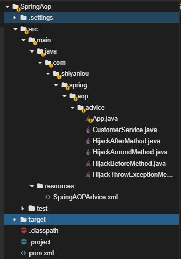

第二个项目结构：

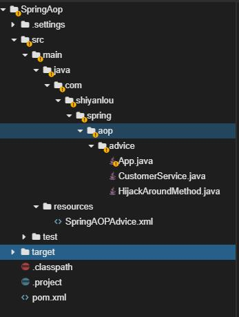

第三个项目结构：

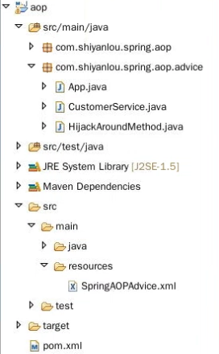

第三个项目结构：

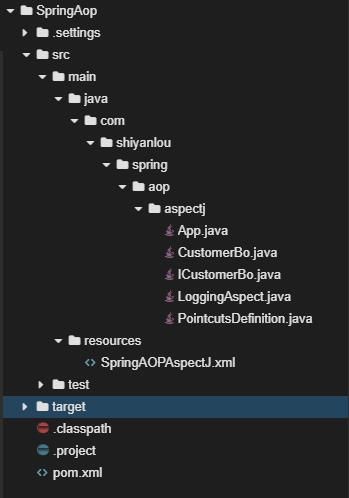

---

#### 1.3 实验步骤


**Spring AOP 即 Aspect-oriented programming，面向切面编程，是作为面向对象编程的一种补充，专门用于处理系统中分布于各个模块（不同方法）中的交叉关注点的问题。简单地说，就是一个拦截器**（interceptor）拦截一些处理过程。

例如，当一个 method 被执行，Spring AOP 能够劫持正在运行的 method，在 method 执行前或者后加入一些额外的功能。

在 Spring AOP 中，支持 4 种类型的通知（Advice）：

- Before advice - method 执行前通知。
- After returning advice - method 返回一个结果后通知。
- After throwing advice - method 抛出异常后通知。
- Around advice - 环绕通知，结合了以上三种。

---

#### 2.0 一个 Spring AOP 的实例


下边这个例子解释 Spring AOP 怎样工作。首先一个简单的不使用 AOP 的例子。先创建一个简单的 Service，为了稍后演示，这个类中加了几个简单的打印 method。

创建一个 Maven 项目 `SpringAop`：

```bash
mvn archetype:generate -DgroupId=com.shiyanlou.spring -DartifactId=SpringAop -DarchetypeArtifactId=maven-archetype-quickstart
```

选择 File->Open Workspace 切换工作空间，选择 `SpringAop` 目录，**必须切换到该目录下，否则识别不了项目**，如果没有继承之前的实验环境，请按照实验 2 重新导入 maven 包。

添加 maven 依赖

```xml
<?xml version = "1.0" encoding = "UTF-8"?>
<project xmlns = "http://maven.apache.org/POM/4.0.0" xmlns:xsi = "http://www.w3.org/2001/XMLSchema-instance"
         xsi:schemaLocation = "http://maven.apache.org/POM/4.0.0 http://maven.apache.org/xsd/maven-4.0.0.xsd">
    <modelVersion>4.0.0</modelVersion>

    <groupId>com.shiyanlou</groupId>
    <artifactId>SpringAop</artifactId>
    <version>1.0-SNAPSHOT</version>

    <name>SpringAop</name>

    <properties>
        <project.build.sourceEncoding>UTF-8</project.build.sourceEncoding>
        <maven.compiler.source>1.8</maven.compiler.source>
        <maven.compiler.target>1.8</maven.compiler.target>
        <spring.version>5.1.1.RELEASE</spring.version>

    </properties>

    <dependencies>
        <dependency>
            <groupId>org.springframework</groupId>
            <artifactId>spring-core</artifactId>
            <version>${spring.version}</version>
        </dependency>
        <dependency>
            <groupId>org.springframework</groupId>
            <artifactId>spring-context</artifactId>
            <version>${spring.version}</version>
        </dependency>
        <dependency>
            <groupId>org.aspectj</groupId>
            <artifactId>aspectjweaver</artifactId>
            <version>1.9.2</version>
        </dependency>
        <dependency>
            <groupId>org.aspectj</groupId>
            <artifactId>aspectjtools</artifactId>
            <version>1.9.2</version>
        </dependency>
        <dependency>
            <groupId>org.aspectj</groupId>
            <artifactId>aspectjrt</artifactId>
            <version>1.9.2</version>
        </dependency>
        <dependency>
            <groupId>cglib</groupId>
            <artifactId>cglib</artifactId>
            <version>3.2.9</version>
        </dependency>
    </dependencies>


</project>
```

创建类 CustomerService.java 如下：

```java
package com.shiyanlou.spring.aop.advice;

public class CustomerService {

    private String name;
    private String url;

    public void setName(String name) {
        this.name = name;
    }

    public void setUrl(String url) {
        this.url = url;
    }

    public void printName() {
        System.out.println("Customer name : " + this.name);
    }

    public void printURL() {
        System.out.println("Customer website : " + this.url);
    }

    public void printThrowException() {
        throw new IllegalArgumentException();
    }

}
```

在 `src/main/resources/` 下新建 xml 配置文件 SpringAOPAdvice.xml 如下：

```xml
<?xml version = "1.0" encoding = "UTF-8"?>
<beans xmlns = "http://www.springframework.org/schema/beans"
    xmlns:xsi = "http://www.w3.org/2001/XMLSchema-instance"
    xsi:schemaLocation = "http://www.springframework.org/schema/beans
    http://www.springframework.org/schema/beans/spring-beans.xsd">

    <bean id = "customerService" class = "com.shiyanlou.spring.aop.advice.CustomerService">
        <property name = "name" value = "Shiyanlou" />
        <property name = "url" value = "https://www.lanqiao.cn" />
    </bean>

</beans>
```

将我们项目中的 App.java 移动到 /aop/advice 下，然后在 App.java 中添加如下代码：

```java
package com.shiyanlou.spring.aop.advice;

import org.springframework.context.ApplicationContext;
import org.springframework.context.support.ClassPathXmlApplicationContext;

public class App {

    public static void main(String[] args) {
        ApplicationContext appContext = new ClassPathXmlApplicationContext(
                new String[] { "SpringAOPAdvice.xml" });

        CustomerService cust = (CustomerService) appContext.getBean("customerService");

        System.out.println("*************************");
        cust.printName();
        System.out.println("*************************");
        cust.printURL();
        System.out.println("*************************");
        try {
            cust.printThrowException();
        } catch (Exception e) {

        }
    }
}
```

打开控制器，输入：

```bash
mvn compile
mvn exec:java -Dexec.mainClass="com.shiyanlou.spring.aop.advice.App"
```

实验结果如图：

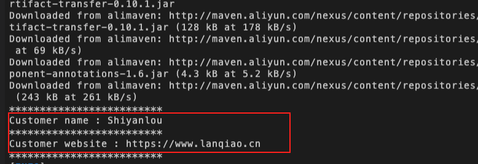

---

四种类型的通知（Advice）


下面来介绍 4 种类型的通知（Advice）。

#### 2.1 Before Advice

method 运行前，将运行下面的代码。

HijackBeforeMethod.java 如下:

```java
package com.shiyanlou.spring.aop.advice;

import java.lang.reflect.Method;
import org.springframework.aop.MethodBeforeAdvice;

public class HijackBeforeMethod implements MethodBeforeAdvice {

    public void before(Method arg0, Object[] args, Object target)
            throws Throwable {
        System.out.println("HijackBeforeMethod : Before method hijacked!");

    }

}
```

在配置文件中加入新的 bean 配置 HijackBeforeMethod，然后创建一个新的代理（proxy），命名为 customerServiceProxy。`target` 定义你想劫持哪个 bean；`interceptorNames` 定义想用哪个 class(advice) 劫持 target。SpringAOPAdvice.xml 如下：

```xml
<beans xmlns = "http://www.springframework.org/schema/beans"
    xmlns:xsi = "http://www.w3.org/2001/XMLSchema-instance"
    xsi:schemaLocation = "http://www.springframework.org/schema/beans
    http://www.springframework.org/schema/beans/spring-beans.xsd">

    <bean id = "customerService" class = "com.shiyanlou.spring.aop.advice.CustomerService">
        <property name = "name" value = "Shiyanlou" />
        <property name = "url" value = "https://www.lanqiao.cn" />
    </bean>

    <bean id = "hijackBeforeMethodBean" class = "com.shiyanlou.spring.aop.advice.HijackBeforeMethod" />

    <bean id = "customerServiceProxy" class = "org.springframework.aop.framework.ProxyFactoryBean">
        <property name = "target" ref = "customerService" />
        <property name = "interceptorNames">
            <list>
                <value>hijackBeforeMethodBean</value>
            </list>
        </property>
    </bean>

</beans>
```

用 Spring proxy 之前，必须添加 CGLIB 类库，在之前的 pom.xml 文件中，已经添加到了其中，以下是 pom.xml 依赖：

```xml
    <dependency>
        <groupId>cglib</groupId>
        <artifactId>cglib</artifactId>
        <version>3.2.9</version>
    </dependency>
```

App.java 如下：

```java
package com.shiyanlou.spring.aop.advice;

import org.springframework.context.ApplicationContext;
import org.springframework.context.support.ClassPathXmlApplicationContext;

public class App {

    public static void main(String[] args) {
        ApplicationContext appContext = new ClassPathXmlApplicationContext(
                new String[] { "SpringAOPAdvice.xml" });

        CustomerService cust = (CustomerService) appContext.getBean("customerServiceProxy");

        System.out.println("使用Spring AOP 如下");
        System.out.println("*************************");
        cust.printName();
        System.out.println("*************************");
        cust.printURL();
        System.out.println("*************************");

        try {
            cust.printThrowException();
        } catch (Exception e) {

        }

    }

}
```

输入命令:

```bash
mvn compile
mvn exec:java -Dexec.mainClass="com.shiyanlou.spring.aop.advice.App"
```

实验结果如下：

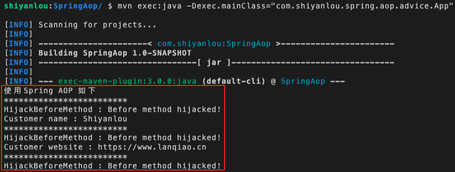

每一个 customerService 的 method 运行前，都将先执行 HijackBeforeMethod 的 before 方法。

#### 2.2 After Returning Advice

创建一个实现了接口 AfterReturningAdvice 的 class，method 运行后，直到返回结果后，才运行下边的代码，如果没有返回结果，将不运行切入的代码。

HijackAfterMethod.java 如下：

```java
package com.shiyanlou.spring.aop.advice;

import java.lang.reflect.Method;
import org.springframework.aop.AfterReturningAdvice;

public class HijackAfterMethod implements AfterReturningAdvice {

    public void afterReturning(Object returnValue, Method method, Object[] args, Object target) throws Throwable {
        System.out.println("HijackAfterMethod : After method hijacked!");
    }
}
```

修改 bean 配置文件，加入 hijackAfterMethodBean 配置，SpringAOPAdvice.xml 如下：

```xml
<beans xmlns = "http://www.springframework.org/schema/beans"
    xmlns:xsi = "http://www.w3.org/2001/XMLSchema-instance"
    xsi:schemaLocation = "http://www.springframework.org/schema/beans
    http://www.springframework.org/schema/beans/spring-beans.xsd">

    <bean id = "customerService" class = "com.shiyanlou.spring.aop.advice.CustomerService">
        <property name = "name" value = "lanqiao" />
        <property name = "url" value = "lanqiao.cn" />
    </bean>

    <bean id = "hijackBeforeMethodBean" class = "com.shiyanlou.spring.aop.advice.HijackBeforeMethod" />
    <bean id = "hijackAfterMethodBean" class = "com.shiyanlou.spring.aop.advice.HijackAfterMethod" />

    <bean id = "customerServiceProxy" class = "org.springframework.aop.framework.ProxyFactoryBean">
        <property name = "target" ref = "customerService" />
        <property name = "interceptorNames">
            <list>
                <value>hijackAfterMethodBean</value>
            </list>
        </property>
    </bean>

</beans>
```

现在再运行 App.java 后输出如下：

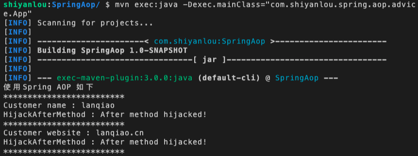

每一个 customerService 的 method 运行后，都将先执行 HijackAfterMethod 的 afterReturning 方法。

#### 2.3 Afetr Throwing Advice

创建一个实现了 ThrowsAdvice 接口的 class，劫持 IllegalArgumentException 异常，目标 method 运行时，抛出 IllegalArgumentException 异常后，运行切入的方法。HijackThrowExceptionMethod.java 如下：

```java
package com.shiyanlou.spring.aop.advice;

import org.springframework.aop.ThrowsAdvice;

public class HijackThrowExceptionMethod implements ThrowsAdvice {

    public void afterThrowing(IllegalArgumentException e) throws Throwable {
        System.out.println("HijackThrowException : Throw exception hijacked!");
    }

}
```

修改 bean 配置文件，加入了 hijackThrowExceptionBean，SpringAOPAdvice.xml 如下：

```xml
<beans xmlns = "http://www.springframework.org/schema/beans"
    xmlns:xsi = "http://www.w3.org/2001/XMLSchema-instance"
    xsi:schemaLocation = "http://www.springframework.org/schema/beans
    http://www.springframework.org/schema/beans/spring-beans.xsd">

    <bean id = "customerService" class = "com.shiyanlou.spring.aop.advice.CustomerService">
        <property name = "name" value = "lanqiao" />
        <property name = "url" value = "lanqiao.cn" />
    </bean>

    <bean id = "hijackBeforeMethodBean" class = "com.shiyanlou.spring.aop.advice.HijackBeforeMethod" />
    <bean id = "hijackAfterMethodBean" class = "com.shiyanlou.spring.aop.advice.HijackAfterMethod" />
    <bean id = "hijackThrowExceptionBean" class = "com.shiyanlou.spring.aop.advice.HijackThrowExceptionMethod" />

    <bean id = "customerServiceProxy" class = "org.springframework.aop.framework.ProxyFactoryBean">
        <property name = "target" ref = "customerService" />
        <property name = "interceptorNames">
            <list>
                <value>hijackThrowExceptionBean</value>
            </list>
        </property>
    </bean>

</beans>
```

运行结果如下：

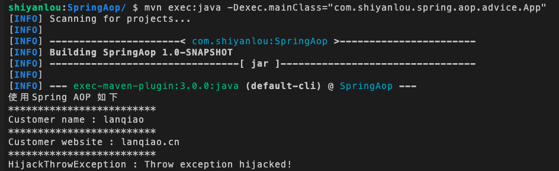

#### 2.4 Around Advice

结合了以上 3 种形式的 Advice，创建一个实现了接口 MethodInterceptor 的 class，你必须通过 `methodInvocation.proceed()` 来调用原来的方法，即通过调用 `methodInvocation.proceed()` 来调用 CustomerService 中的每一个方法，当然也可以不调用原方法 HijackAroundMethod.java 如下：

```java
package com.shiyanlou.spring.aop.advice;

import java.util.Arrays;
import org.aopalliance.intercept.MethodInterceptor;
import org.aopalliance.intercept.MethodInvocation;

public class HijackAroundMethod implements MethodInterceptor {

    public Object invoke(MethodInvocation methodInvocation) throws Throwable {
        System.out.println("Method name : "
                + methodInvocation.getMethod().getName());
        System.out.println("Method arguments : "
                + Arrays.toString(methodInvocation.getArguments()));

        // 相当于 MethodBeforeAdvice
        System.out.println("HijackAroundMethod : Before method hijacked!");

        try {
            // 调用原方法，即调用 CustomerService 中的方法
            Object result = methodInvocation.proceed();

            // 相当于 AfterReturningAdvice
            System.out.println("HijackAroundMethod : After method hijacked!");

            return result;

        } catch (IllegalArgumentException e) {
            // 相当于 ThrowsAdvice
            System.out.println("HijackAroundMethod : Throw exception hijacked!");
            throw e;
        }
    }

}
```

修改 bean 配置文件，加入了 hijackAroundMethodBean，SpringAOPAdvice.xml 如下：

```xml
<beans xmlns = "http://www.springframework.org/schema/beans"
    xmlns:xsi = "http://www.w3.org/2001/XMLSchema-instance"
    xsi:schemaLocation = "http://www.springframework.org/schema/beans
    http://www.springframework.org/schema/beans/spring-beans.xsd">

    <bean id = "customerService" class = "com.shiyanlou.spring.aop.advice.CustomerService">
        <property name = "name" value = "lanqiao" />
        <property name = "url" value = "lanqiao.cn" />
    </bean>

    <bean id = "hijackBeforeMethodBean" class = "com.shiyanlou.spring.aop.advice.HijackBeforeMethod" />
    <bean id = "hijackAfterMethodBean" class = "com.shiyanlou.spring.aop.advice.HijackAfterMethod" />
    <bean id = "hijackThrowExceptionBean" class = "com.shiyanlou.spring.aop.advice.HijackThrowExceptionMethod" />
    <bean id = "hijackAroundMethodBean" class = "com.shiyanlou.spring.aop.advice.HijackAroundMethod" />

    <bean id = "customerServiceProxy" class = "org.springframework.aop.framework.ProxyFactoryBean">
        <property name = "target" ref = "customerService" />
        <property name = "interceptorNames">
            <list>
                <value>hijackAroundMethodBean</value>
            </list>
        </property>
    </bean>
</beans>
```

运行结果：

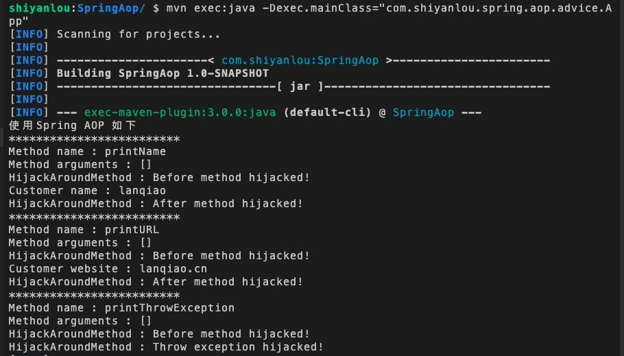

---

#### 2.5 改进


上边的结果中，CustomerService.java 中，全部的 method 方法全部被拦截了，下边我们将展示怎样利用 Pointcuts 只拦截 `printName()`。

在 Spring AOP 中，有 3 个常用的概念，Advices、Pointcut、Advisor，解释如下：

- Advices：表示一个 method 执行前或执行后的动作。
- Pointcut：表示根据 method 的名字或者正则表达式去拦截一个 method。
- Advisor：Advice 和 Pointcut 组成的独立的单元，并且能够传给 proxy factory 对象。

我们可以用名字匹配法和正则表达式匹配法去匹配要拦截的 method。

#### 2.6 Pointcut - Name match example

通过 pointcut 和 advisor 拦截 `printName()` 方法。创建一个 NameMatchMethodPointcut 的 bean，将你想拦截的方法的名字 printName 注入到属性 mappedName，如下：

```xml
<bean id = "customerPointcut"
        class = "org.springframework.aop.support.NameMatchMethodPointcut">
        <property name = "mappedName" value = "printName" />
</bean>
```

创建一个 DefaultPointcutAdvisor 的 advisor bean，将 pointcut 和 advice 关联起来。

```xml
<bean id = "customerAdvisor"
        class = "org.springframework.aop.support.DefaultPointcutAdvisor">
        <property name = "pointcut" ref = "customerPointcut" />
        <property name = "advice" ref = "hijackAroundMethodBean" />
</bean>
```

更改代理的 interceptorNames 值，将上边的 advisor（customerAdvisor）替代原来的 hijackAroundMethodBean。

```xml
<bean id = "customerServiceProxy"
        class = "org.springframework.aop.framework.ProxyFactoryBean">

        <property name = "target" ref = "customerService" />

        <property name = "interceptorNames">
            <list>
                <value>customerAdvisor</value>
            </list>
        </property>
</bean>
```

所有的配置文件如下：

```xml
<beans xmlns = "http://www.springframework.org/schema/beans"
    xmlns:xsi = "http://www.w3.org/2001/XMLSchema-instance"
    xsi:schemaLocation = "http://www.springframework.org/schema/beans
    http://www.springframework.org/schema/beans/spring-beans.xsd">

    <bean id = "customerService" class = "com.shiyanlou.spring.aop.advice.CustomerService">
        <property name = "name" value = "lanqiao" />
        <property name = "url" value = "lanqiao.cn" />
    </bean>

    <bean id = "hijackAroundMethodBean" class = "com.shiyanlou.spring.aop.advice.HijackAroundMethod" />

    <bean id = "customerServiceProxy" class = "org.springframework.aop.framework.ProxyFactoryBean">
        <property name = "target" ref = "customerService" />
        <property name = "interceptorNames">
            <list>
                <value>customerAdvisor</value>
            </list>
        </property>
    </bean>

    <bean id = "customerPointcut" class = "org.springframework.aop.support.NameMatchMethodPointcut">
        <property name = "mappedName" value = "printName" />
    </bean>

    <bean id = "customerAdvisor" class = "org.springframework.aop.support.DefaultPointcutAdvisor">
        <property name = "pointcut" ref = "customerPointcut" />
        <property name = "advice" ref = "hijackAroundMethodBean" />
    </bean>

</beans>
```

再运行一下 App.java，输出结果如下：

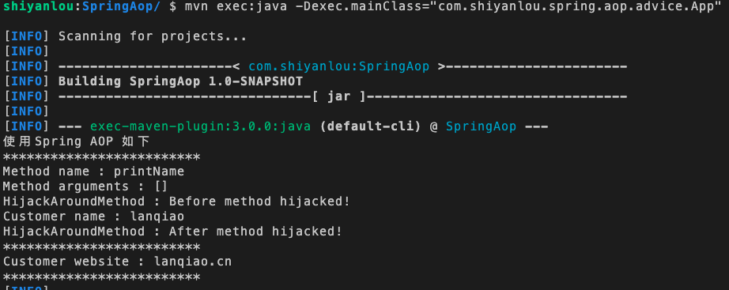

以上运行结果显示，只拦截了 `printName()` 方法。

注意：以上配置中 pointcut 和 advisor 可以合并在一起配置，即不用单独配置 customerPointcut 和 customerAdvisor，只要配置 customerAdvisor 时 class 选择 NameMatchMethodPointcutAdvisor 如下：

```xml
<bean id = "customerAdvisor" class = "org.springframework.aop.support.NameMatchMethodPointcutAdvisor">
        <property name = "mappedName" value = "printName" />
        <property name = "advice" ref = "hijackAroundMethodBean" />
</bean>
```

这样，整个配置文件如下：

```xml
<?xml version = "1.0" encoding = "UTF-8"?>
<beans xmlns = "http://www.springframework.org/schema/beans"
    xmlns:xsi = "http://www.w3.org/2001/XMLSchema-instance"
    xsi:schemaLocation = "http://www.springframework.org/schema/beans
    http://www.springframework.org/schema/beans/spring-beans.xsd">

     <bean id = "customerService" class = "com.shiyanlou.spring.aop.advice.CustomerService">
        <property name = "name" value = "lanqiao" />
        <property name = "url" value = "lanqiao.cn" />
    </bean>

    <bean id = "hijackAroundMethodBean" class = "com.shiyanlou.spring.aop.advice.HijackAroundMethod" />

    <bean id = "customerServiceProxy" class = "org.springframework.aop.framework.ProxyFactoryBean">
        <property name = "target" ref = "customerService" />
        <property name = "interceptorNames">
            <list>
                <value>customerAdvisor</value>
            </list>
        </property>
    </bean>


    <bean id = "customerAdvisor" class = "org.springframework.aop.support.NameMatchMethodPointcutAdvisor">
        <property name = "mappedName" value = "printName" />
        <property name = "advice" ref = "hijackAroundMethodBean" />
    </bean>

</beans>
```

实际上这种做法将 method 名字与具体的 advice 捆绑在一起，有悖于 Spring 松耦合理念，如果将 method 名字单独配置成 pointcut（切入点），advice 和 pointcut 的结合会更灵活，使一个 pointcut 可以和多个 advice 结合。

#### 2.7 Pointcut - Regular exxpression match example

你可以配置用正则表达式匹配需要拦截的 method，如下配置：

```xml
<bean id = "customerAdvisor" class = "org.springframework.aop.support.RegexpMethodPointcutAdvisor">
        <property name = "patterns">
            <list>
                <value>.*URL.*</value>
            </list>
        </property>
        <property name = "advice" ref = "hijackAroundMethodBean" />
    </bean>
```

配置文件详情如下：

```xml
<?xml version = "1.0" encoding = "UTF-8"?>
<beans xmlns = "http://www.springframework.org/schema/beans"
    xmlns:xsi = "http://www.w3.org/2001/XMLSchema-instance"
    xsi:schemaLocation = "http://www.springframework.org/schema/beans
    http://www.springframework.org/schema/beans/spring-beans.xsd">

    <bean id = "customerService" class = "com.shiyanlou.spring.aop.advice.CustomerService">
        <property name = "name" value = "lanqiao" />
        <property name = "url" value = "lanqiao.cn" />
    </bean>

    <bean id = "hijackAroundMethodBean" class = "com.shiyanlou.spring.aop.advice.HijackAroundMethod" />

    <bean id = "customerServiceProxy" class = "org.springframework.aop.framework.ProxyFactoryBean">
        <property name = "target" ref = "customerService" />
        <property name = "interceptorNames">
            <list>
                <value>customerAdvisor</value>
            </list>
        </property>
    </bean>

    <bean id = "customerAdvisor" class = "org.springframework.aop.support.RegexpMethodPointcutAdvisor">
        <property name = "patterns">
            <list>
                <value>.*URL.*</value>
            </list>
        </property>
        <property name = "advice" ref = "hijackAroundMethodBean" />
    </bean>

</beans>
```

运行结果：

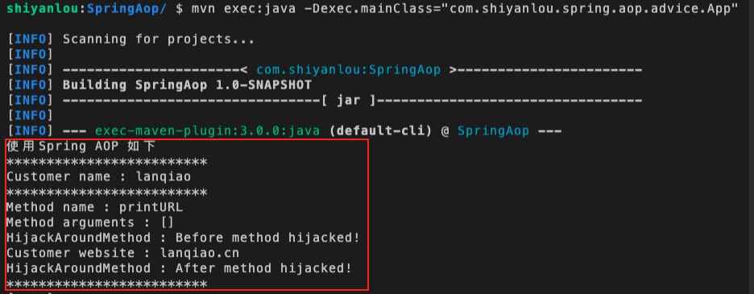

---

#### 3.0 利用 BeanNameAutoProxyCreator 自动创建 proxy


在前面两节的例子中，在配置文件中，我们必须手动为每一个需要 AOP 的 bean 创建 Proxy bean（ProxyFactoryBean）。

这不是一个好的体验，例如，我们想让 DAO 层的所有 bean 都支持 AOP，以便写 SQL 日志，那么必须手工创建很多的 ProxyFactoryBean，这样会直接导致 xml 配置文件内容成几何级的倍增，不利于 xml 配置维护。幸运的是，Spring 有两种方法，可以为你自动创建 proxy。

手工创建 ProxyFactoryBean 如下：

```xml
<beans xmlns = "http://www.springframework.org/schema/beans"
    xmlns:xsi = "http://www.w3.org/2001/XMLSchema-instance"
    xsi:schemaLocation = "http://www.springframework.org/schema/beans
        http://www.springframework.org/schema/beans/spring-beans.xsd">

    <bean id = "customerService" class = " com.shiyanlou.spring.aop.advice.CustomerService">
        <property name = "name" value = "lanqiao" />
        <property name = "url" value = "lanqiao.cn" />
    </bean>

    <bean id = "hijackAroundMethodBean" class = " com.shiyanlou.spring.aop.advice.HijackAroundMethod" />

    <bean id = "customerServiceProxy"
        class = "org.springframework.aop.framework.ProxyFactoryBean">
        <property name = "target" ref = "customerService" />
        <property name = "interceptorNames">
            <list>
                <value>customerAdvisor</value>
            </list>
        </property>
    </bean>

    <bean id = "customerAdvisor"    class = "org.springframework.aop.support.NameMatchMethodPointcutAdvisor">
        <property name = "mappedName" value = "printName" />
        <property name = "advice" ref = " hijackAroundMethodBean " />
    </bean>
</beans>
```

配置完后要得到 customerServiceProxy，需要如下代码：

```bash
CustomerService cust = (CustomerService) appContext.getBean("customerServiceProxy");
```

在自动模式中，我们需要创建 BeanNameAutoProxyCreator，将所有的 bean（通过名字或正则表达式匹配）和 advisor 形成一个独立的单元，SpringAOPAdvice.xml 配置如下：

```xml
<beans xmlns = "http://www.springframework.org/schema/beans"
    xmlns:xsi = "http://www.w3.org/2001/XMLSchema-instance"
    xsi:schemaLocation = "http://www.springframework.org/schema/beans
        http://www.springframework.org/schema/beans/spring-beans.xsd">

    <bean id = "customerService" class = " com.shiyanlou.spring.aop.advice.CustomerService">
        <property name = "name" value = "lanqiao" />
        <property name = "url" value = "lanqiao.cn" />
    </bean>

    <bean id = "hijackAroundMethodBean" class = " com.shiyanlou.spring.aop.advice.HijackAroundMethod" />

    <bean
    class = "org.springframework.aop.framework.autoproxy.BeanNameAutoProxyCreator">
        <property name = "beanNames">
            <list>
                <value>*Service</value>
            </list>
        </property>
        <property name = "interceptorNames">
            <list>
                <value>customerAdvisor</value>
            </list>
        </property>
    </bean>

    <bean id = "customerAdvisor" class = "org.springframework.aop.support.NameMatchMethodPointcutAdvisor">
        <property name = "mappedName" value = "printName" />
        <property name = "advice" ref = "hijackAroundMethodBean" />
    </bean>
</beans>
```

以上配置中只要 bean 的 id 符合 `*Service`，就会自动创建 proxy，所以，可以用以下代码获得 proxy。

```bash
CustomerService cust = (CustomerService) appContext.getBean("customerService");
```

---

使用 AspectJ 框架实现 Spring AOP


AspectJ 是基于注释（Annotation）的，所以需要 JDK5.0 以上的支持。

AspectJ 支持的注解类型如下：

- @Before
- @After
- @AfterReturning
- @AfterThrowing
- @Around

#### 3.1 准备工作

首先定义一个简单的 bean，CustomerBo 实现了接口 ICustomerBo。ICustomerBo.java 如下：

```java
package com.shiyanlou.spring.aop.aspectj;

public interface ICustomerBo {
    void addCustomer();
    void deleteCustomer();
    String AddCustomerReturnValue();
    void addCustomerThrowException() throws Exception;
    void addCustomerAround(String name);
}
```

CustomerBo.java 如下：

```java
package com.shiyanlou.spring.aop.aspectj;

public class CustomerBo implements ICustomerBo {

    public void addCustomer() {
        System.out.println("addCustomer() is running ...");
    }

    public void deleteCustomer() {
        System.out.println("deleteCustomer() is running ...");
    }

    public String AddCustomerReturnValue() {
        System.out.println("AddCustomerReturnValue() is running ...");
        return "abc";
    }

    public void addCustomerThrowException() throws Exception {
        System.out.println("addCustomerThrowException() is running ...");
        throw new Exception("Generic Error");
    }

    public void addCustomerAround(String name) {
        System.out.println("addCustomerAround() is running ,args:"+name);

    }

}
```

#### 4.0  简单的 AspectJ，Advice 和 Pointcut 结合在一起

首先没有引入 Aspect 之前，Advice 和 Pointcut 是混在一起的，步骤如下：

- 创建一个 Aspect 类
- 配置 Spring 配置文件

由于接下来要使用 aspectj 的 jar 包，首先添加 maven 依赖。需要在 pom.xml 添加：

```xml
        <dependency>
            <groupId>org.aspectj</groupId>
            <artifactId>aspectjweaver</artifactId>
            <version>1.9.2</version>
        </dependency>
        <dependency>
            <groupId>org.aspectj</groupId>
            <artifactId>aspectjtools</artifactId>
            <version>1.9.2</version>
        </dependency>
        <dependency>
            <groupId>org.aspectj</groupId>
            <artifactId>aspectjrt</artifactId>
            <version>1.9.2</version>
        </dependency>
```

注:我们在新建项目时就已经添加了这些依赖，这里写出来只是让同学们知道这些包的作用

创建 AspectJ 类，LoggingAspect.java 如下：

```java
package com.shiyanlou.spring.aop.aspectj;

import org.aspectj.lang.JoinPoint;
import org.aspectj.lang.annotation.After;
import org.aspectj.lang.annotation.Aspect;
import org.aspectj.lang.annotation.Before;

@Aspect
public class LoggingAspect {

    @Before("execution(public * com.shiyanlou.spring.aop.aspectj.CustomerBo.addCustomer(..))")
    public void logBefore(JoinPoint joinPoint){
        System.out.println("logBefore() is running ...");
        System.out.println("hijacked:"+joinPoint.getSignature().getName());
        System.out.println("**********");
    }

    @After("execution(public * com.shiyanlou.spring.aop.aspectj.CustomerBo.deleteCustomer(..))")
    public void logAfter(JoinPoint joinPoint){
        System.out.println("logAfter() is running ...");
        System.out.println("hijacked:"+joinPoint.getSignature().getName());
        System.out.println("**********");
    }
}
```

解释：

1. 必须使用 @Aspect 在 LoggingAspect 声明之前注释，以便被框架扫描到。
2. 此例 Advice 和 Pointcut 结合在一起，类中的具体方法 `logBefore` 和 `logAfter` 即为 Advice，是要注入的代码，Advice 方法上的表达式为 Pointcut 表达式，即定义了切入点，上例中 `@Before` 注释的表达式代表执行 `CustomerBo.addCustomer` 方法时注入 `logBefore` 代码。
3. 在 LoggingAspect 方法上加入 `@Before` 或者 `@After` 等注释。
4. `execution(public * com.shiyanlou.spring.aop.aspectj.CustomerBo.addCustomer(..))` 是 Aspect 的切入点表达式，其中，`*` 代表返回类型，后边的就要定义要拦截的方法名。这里写的的是 `com.shiyanlou.spring.aop.aspectj.CustomerBo.addCustomer` 表示拦截 `CustomerBo` 中的 `addCustomer` 方法，`(..)` 代表参数匹配，此处表示匹配任意数量的参数，可以是 0 个也可以是多个，如果你确定这个方法不需要使用参数可以直接用 `()`，还可以使用 `(*)` 来匹配一个任意类型的参数，还可以使用 `(* , String )`，这样代表匹配两个参数，第二个参数必须是 String 类型的参数。
5. AspectJ 表达式，可以对整个包定义，例如 `execution ( * com.shiyanlou.spring.aop.aspectj.*.*(..))` 表示切入点是 `com.shiyanlou.spring.aop.aspectj` 包中的任意一个类的任意方法，具体的表达式请自行搜索。

配置 SpringAOPAspectj.xml 文件，如下：

```xml
<?xml version = "1.0" encoding = "UTF-8"?>
<beans xmlns = "http://www.springframework.org/schema/beans"
    xmlns:xsi = "http://www.w3.org/2001/XMLSchema-instance"
    xmlns:aop = "http://www.springframework.org/schema/aop"
    xsi:schemaLocation = "http://www.springframework.org/schema/beans
    http://www.springframework.org/schema/beans/spring-beans.xsd
    http://www.springframework.org/schema/aop
    http://www.springframework.org/schema/aop/spring-aop.xsd">

    <aop:aspectj-autoproxy/>

    <bean id = "customerBo" class = "com.shiyanlou.spring.aop.aspectj.CustomerBo"/>

    <bean id = "logAspect" class = "com.shiyanlou.spring.aop.aspectj.LoggingAspect" />

</beans>
```

`<aop:aspectj-autoproxy/>` 启动 AspectJ 支持，这样 Spring 会自动寻找用 @Aspect 注释过的类，其他的配置与 Spring 普通 bean 配置一样。

执行 App.java 如下：

```java
package com.shiyanlou.spring.aop.aspectj;

import org.springframework.context.ApplicationContext;
import org.springframework.context.support.ClassPathXmlApplicationContext;


public class App {
    public static void main(String[] args) {

        ApplicationContext appContext = new ClassPathXmlApplicationContext(new String[] { "SpringAOPAspectj.xml" });
        ICustomerBo customer = (ICustomerBo)appContext.getBean("customerBo");

        customer.addCustomer();

        System.out.println("-------------------------------------------");

        customer.deleteCustomer();

    }
}
```

控制台输入命令：

```bash
mvn clean compile
mvn exec:java -Dexec.mainClass="com.shiyanlou.spring.aop.aspectj.App"
```

实验结果如下：

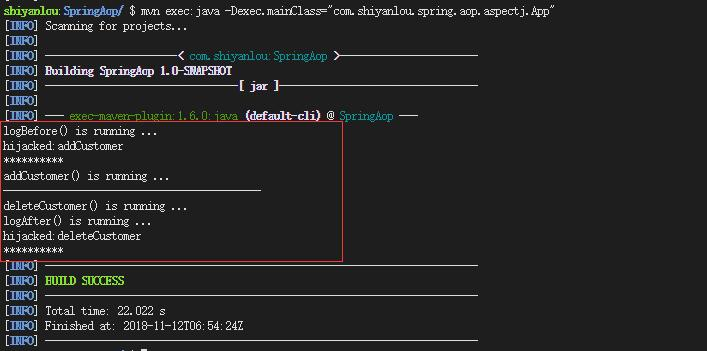

#### 4.2 将 Advice 和 Pointcut 分开

需要三步：

1. 创建 Pointcut
2. 创建 Advice
3. 配置 Spring 的配置文件

定义 Pointcut，创建 PointcutsDefinition.java，如下：

```java
package com.shiyanlou.spring.aop.aspectj;

import org.aspectj.lang.annotation.Aspect;
import org.aspectj.lang.annotation.Pointcut;

@Aspect
public class PointcutsDefinition {

    @Pointcut("execution(* com.shiyanlou.spring.aop.aspectj.CustomerBo.*(..))")
    public void customerLog() {
    }
}
```

解释：

1. 类声明前加入 @Aspect 注释，以便被框架扫描到。
2. @Pointcut 是切入点声明，指定需要注入的代码的位置，如上例中指定切入点为 CustomerBo 类中的所有方法，在实际业务中往往是指定切入点到一个逻辑层，例如 `execution (* com.shiyanlou.spring.aop.aspectj.*.*(..)）`，表示 aop 切入点为 aspectj 包中所有类的所有方法，具体的表达式后边会有介绍。
3. 方法 customerLog 是一个签名，在 Advice 中可以用此签名代替切入点表达式，所以不需要在方法体内编写实际代码，只起到助记功能，例如此处代表操作 CustomerBo 类时需要的切入点。

创建 LoggingAspect.java：

```java
package com.shiyanlou.spring.aop.aspectj;

import org.aspectj.lang.JoinPoint;
import org.aspectj.lang.annotation.After;
import org.aspectj.lang.annotation.Aspect;
import org.aspectj.lang.annotation.Before;

@Aspect
public class LoggingAspect {

    @Before("com.shiyanlou.spring.aop.aspectj.PointcutsDefinition.customerLog()")
    public void logBefore(JoinPoint joinPoint){
        System.out.println("logBefore() is running ...");
        System.out.println("hijacked:"+joinPoint.getSignature().getName());
        System.out.println("**********");
    }

    @After("com.shiyanlou.spring.aop.aspectj.PointcutsDefinition.customerLog()")
    public void logAfter(JoinPoint joinPoint){
        System.out.println("logAfter() is running ...");
        System.out.println("hijacked:"+joinPoint.getSignature().getName());
        System.out.println("**********");
    }
}
```

解释：

1. @Before 和 @After 使用 PointcutsDefinition 中的方法签名代替 Pointcut 表达式找到相应的切入点，即通过签名找到 PointcutsDefinition 中 customerLog 签名上的 Pointcut 表达式，表达式指定切入点为 CustomerBo 类中的所有方法。所以此例中 Advice 类 LoggingAspect，为 CustomerBo 中的所有方法都加入了 @Before 和 @After 两种类型的两种操作。
2. 对于 PointcutsDefinition 来说，主要职责是定义 Pointcut，可以在其中定义多个切入点，并且可以用便于记忆的方法签名进行定义。
3. 单独定义 Pointcut 的好处是，一是通过使用有意义的方法名，而不是难读的 Pointcut 表达式，使代码更加直观；二是 Pointcut 可以实现共享，被多个 Advice 直接调用。若有多个 Advice 调用某个 Pointcut，而这个 Pointcut 的表达式在将来有改变时，只需修改一个地方，维护更加方便。

配置 Spring 配置文件。

配置 SpringAOPAspectj.xml 文件，如下：

```xml
<beans xmlns = "http://www.springframework.org/schema/beans"
    xmlns:xsi = "http://www.w3.org/2001/XMLSchema-instance"
    xmlns:aop = "http://www.springframework.org/schema/aop"
    xsi:schemaLocation = "http://www.springframework.org/schema/beans
    http://www.springframework.org/schema/beans/spring-beans.xsd
    http://www.springframework.org/schema/aop
    http://www.springframework.org/schema/aop/spring-aop.xsd">

    <aop:aspectj-autoproxy/>

    <bean id = "customerBo" class = "com.shiyanlou.spring.aop.aspectj.CustomerBo"/>

    <bean id = "logAspect" class = "com.shiyanlou.spring.aop.aspectj.LoggingAspect" />

</beans>
```

App.java 不变，运行测试代码 App.java：

```bash
mvn clean compile
mvn exec:java -Dexec.mainClass="com.shiyanlou.spring.aop.aspectj.App"
```

结果如下：

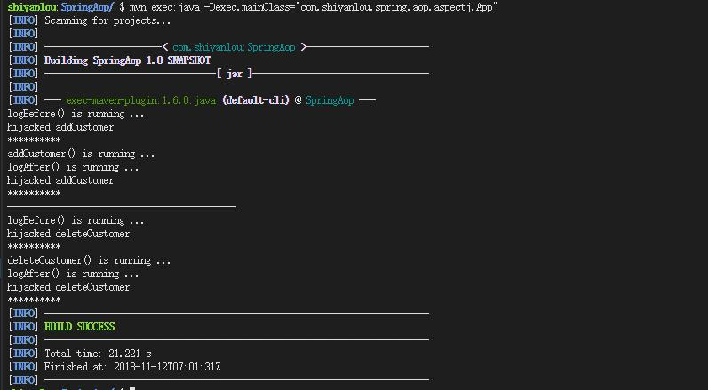

---

---

#### 5.0 实验总结


本次实验内容较多，涵盖了 Spring AOP 的大部分知识，希望大家能够好好理解实验中的内容，亲手实现实验的代码，这样才能有收获

