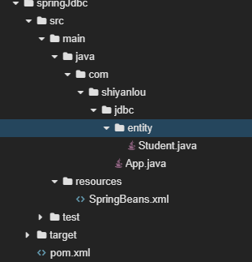
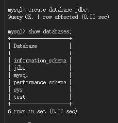
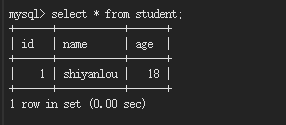
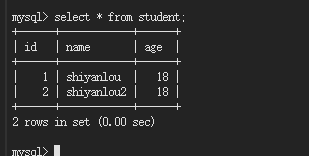
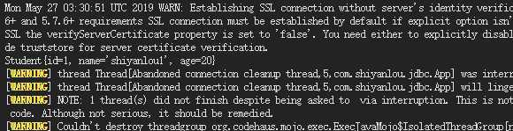
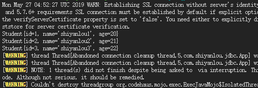

# 	Spring JDBC Template

2022年5月19日16:48:30

---

#### 实验介绍

本节实验将带你学习 Spring 框架中的 JDBC Template，有了 JDBC Template 就不需要自己再手动书写很长的 JDBC 代码来访问数据库了。

#### 知识点

- Spring JDBC Template 增
- Spring JDBC Template 删
- Spring JDBC Template 改
- Spring JDBC Template 查

#### 实验环境

- JDK
- MySQL
- WEB IDE

#### 获取源码

在 Terminal 中，输入：

```bash
wget https://labfile.oss.aliyuncs.com/courses/578/springJdbc.zip
```

然后解压：

```bash
unzip springJdbc.zip
```

---

项目文件结构




#### 实验步骤


接下来我们将正式学习 Spring 框架中的 JDBC 框架。

---

#### Spring JDBC 框架


> **Spring 框架核心的思想就是建立一个 Java 对象的大工厂**，**用户只要给工厂一个指令，工厂就能将用户需要的对象根据配置文件组装好返还给用户。用户需要做的许多工作则可以写成简单的配置文件**。传统的使用 JDBC 的方法，有时候需要组合复杂的的 SQL 语句，还需要去拼接，稍不注意空格、引号，都会导致错误。Spring Jdbc Template 正是为了减少上述的麻烦而设计出来的。它是对 JDBC 的一种封装，抽象我们常用的一些方法。Simple and Stupid 就是它的目标。

Spring Jdbc Template 使用 Spring 的注入功能，可以把 DataSource 注册到 JdbcTemplate 之中。JdbcTemplate 的全限定命名为 org.springframework.jdbc.core.JdbcTemplate。要使用 JdbcTemlate 还需一个 spring-tx 包，这个包包含了事务和异常控制。

JdbcTemplate 主要提供以下五类方法：

- execute 方法：可以用于执行任何 SQL 语句，一般用于执行 DDL 语句。
- update 方法：用于执行新增、修改、删除等语句。
- batchUpdate 方法：用于执行批处理相关语句。
- queryForXXX 方法：用于执行查询相关语句。
- call 方法：用于执行查询相关语句，执行存储过程、函数相关语句。

接下来我们就将依次学习 JdbcTemplate 中的常用方法，来实现对数据库的增删改


---

#### Spring JDBC Template 增


#### 数据库准备

本次课程使用 MySQL。首先启动 MySQL：

```bash
sudo service mysql start
```

然后在终端下输入以下命令，进入到 MySQL 数据库。-u 表示用户名，比如这里的 root，-p 表示密码，这里没有密码就省略了：

```bash
mysql -u root
```

为了实验方便，我们在这里新建一个数据库并取名 jdbc 用作实验。



创建学生表 student 并插入一条数据：

```sql
use jdbc;
create table student(
id int,
name varchar(20),
age int);

insert into student values(1,'shiyanlou',18);
```

检查数据插入情况：



#### 新建项目

首先创建一个新的 maven 工程 `springJdbc`，打开 Terminal，选择 File->Open New Terminal，在终端中输入：

```bash
mvn archetype:generate -DgroupId=com.shiyanlou.jdbc -DartifactId=springJdbc -DarchetypeArtifactId=maven-archetype-quickstart
```

选择 File->Open Workspace 切换工作空间，选择 `springJdbc` 目录，**必须切换到该目录下，否则识别不了项目**。

修改 pom.xml 文件，添加 Spring 的依赖：

```xml
<project xmlns = "http://maven.apache.org/POM/4.0.0" xmlns:xsi = "http://www.w3.org/2001/XMLSchema-instance"
  xsi:schemaLocation = "http://maven.apache.org/POM/4.0.0 http://maven.apache.org/maven-v4_0_0.xsd">
  <modelVersion>4.0.0</modelVersion>

  <groupId>com.shiyanlou.jdbc</groupId>
  <artifactId>springJdbc</artifactId>
  <packaging>jar</packaging>
  <version>1.0-SNAPSHOT</version>

  <name>springJdbc</name>
  <url>http://maven.apache.org</url>

    <properties>
        <project.build.sourceEncoding>UTF-8</project.build.sourceEncoding>
        <maven.compiler.source>1.8</maven.compiler.source>
        <maven.compiler.target>1.8</maven.compiler.target>
        <spring.version>5.1.1.RELEASE</spring.version>
    </properties>

  <dependencies>
    <dependency>
        <groupId>org.springframework</groupId>
        <artifactId>spring-core</artifactId>
        <version>${spring.version}</version>
    </dependency>
    <dependency>
        <groupId>org.springframework</groupId>
        <artifactId>spring-context</artifactId>
        <version>${spring.version}</version>
    </dependency>

    <!-- https://mvnrepository.com/artifact/mysql/mysql-connector-java -->
    <dependency>
        <groupId>mysql</groupId>
        <artifactId>mysql-connector-java</artifactId>
        <version>5.1.46</version>
    </dependency>


    <dependency>
      <groupId>org.springframework</groupId>
      <artifactId>spring-jdbc</artifactId>
      <version>${spring.version}</version>
    </dependency>

    <dependency>
      <groupId>org.springframework</groupId>
      <artifactId>spring-test</artifactId>
      <version>${spring.version}</version>
      <scope>test</scope>
    </dependency>

    <dependency>
      <groupId>junit</groupId>
      <artifactId>junit</artifactId>
      <version>4.12</version>
      <scope>test</scope>
    </dependency>
  </dependencies>
</project>
```

我们先在 src/main/ 下新建一个 Folder，命名为 resources，现在可以开始创建 Spring Bean 配置文件，创建文件 SpringBeans.xml，配置 bean 如下。文件位于 src/main/resources 下。

编辑 SpringBeans.xml 文件如下：

```xml
<?xml version = "1.0" encoding = "UTF-8"?>
<beans xmlns = "http://www.springframework.org/schema/beans"
       xmlns:xsi = "http://www.w3.org/2001/XMLSchema-instance"
       xmlns:context = "http://www.springframework.org/schema/context"
       xsi:schemaLocation = "http://www.springframework.org/schema/beans http://www.springframework.org/schema/beans/spring-beans.xsd
                           http://www.springframework.org/schema/context
                           http://www.springframework.org/schema/context/spring-context.xsd">


    <context:annotation-config/>

    <bean id = "dataSource" class = "org.springframework.jdbc.datasource.DriverManagerDataSource">
        <property name = "driverClassName" value = "com.mysql.jdbc.Driver"/>
        <property name = "url" value = "jdbc:mysql://localhost/jdbc"/>
        <property name = "username" value = "root"/>
        <property name = "password" value = ""/>
    </bean>

    <bean id = "jdbcTemplate" class = "org.springframework.jdbc.core.JdbcTemplate">
        <property name = "dataSource" ref = "dataSource"/>
    </bean>
</beans>
```

最后创建 App.java，在包路径 `com.shiyanlou.jdbc` 下，代码如下:

```java
package com.shiyanlou.jdbc;

import org.springframework.context.ApplicationContext;
import org.springframework.context.support.ClassPathXmlApplicationContext;
import org.springframework.jdbc.core.JdbcTemplate;

public class App {
    private static ApplicationContext context;

    public static void main(String[] args) {
        context = new ClassPathXmlApplicationContext("SpringBeans.xml");

        JdbcTemplate jdbcTemplate = (JdbcTemplate) context.getBean("jdbcTemplate");
        String sql = "insert into student values(?,?,?)";
        int count = jdbcTemplate.update(sql,new Object[]{2,"shiyanlou2",18});
        System.out.println(count);
    }
}
```

运行

```bash
mvn compile
mvn exec:java -Dexec.mainClass="com.shiyanlou.jdbc.App"
```

运行完成后查看数据库，实验结果如下：




---

#### Spring JDBC Template 查


JdbcTemplate 查询数据可以通过 queryForObject 和 query 来实现，queryForObject 用于查询单条数据，query 用于查询多条语句。

#### 查询单条语句

首先创建包 `com.shiyanlou.jdbc.entity`，创建 `Student.java`，代码如下：

```java
package com.shiyanlou.jdbc.entity;

public class Student {

    private int id;
    private String name;
    private int age;

    public void setId(int id) {
        this.id = id;
    }

    public void setName(String name) {
        this.name = name;
    }

    public void setAge(int age) {
        this.age = age;
    }

    @Override
    public String toString() {
        return "Student{" +
                "id=" + id +
                ", name='" + name + '\'' +
                ", age=" + age +
                '}';
    }
}
```

修改 App.java 中的代码：

```java
package com.shiyanlou.jdbc;

import com.shiyanlou.jdbc.entity.Student;
import org.springframework.context.ApplicationContext;
import org.springframework.context.support.ClassPathXmlApplicationContext;
import org.springframework.jdbc.core.BeanPropertyRowMapper;
import org.springframework.jdbc.core.JdbcTemplate;
import org.springframework.jdbc.core.RowMapper;

public class App {
    private static ApplicationContext context;

    public static void main(String[] args) {
        context = new ClassPathXmlApplicationContext("SpringBeans.xml");

        JdbcTemplate jdbcTemplate = (JdbcTemplate) context.getBean("jdbcTemplate");
        String sql = "select * from student";

        RowMapper<Student> rowMapper = new BeanPropertyRowMapper<Student>(Student.class);
        Student student = jdbcTemplate.queryForObject(sql,rowMapper);
        System.out.println(student);
    }
}
```

运行：

```bash
mvn compile
mvn exec:java -Dexec.mainClass="com.shiyanlou.jdbc.App"
```

实验结果如下：



可以看到终端中已经打印出了查询到的数据

#### 查询多条语句

首先在 student 数据库中添加几条数据：

```sql
insert into student values(2,'shiyanlou2',21),(3,'shiyanlou3','22');
```

修改 App.java 中的代码：

```java
package com.shiyanlou.jdbc;

import com.shiyanlou.jdbc.entity.Student;
import org.springframework.context.ApplicationContext;
import org.springframework.context.support.ClassPathXmlApplicationContext;
import org.springframework.jdbc.core.BeanPropertyRowMapper;
import org.springframework.jdbc.core.JdbcTemplate;
import org.springframework.jdbc.core.RowMapper;

import java.util.List;

public class App {
    private static ApplicationContext context;

    public static void main(String[] args) {
        context = new ClassPathXmlApplicationContext("SpringBeans.xml");

        JdbcTemplate jdbcTemplate = (JdbcTemplate) context.getBean("jdbcTemplate");
        String sql = "select * from student";

        RowMapper<Student> rowMapper = new BeanPropertyRowMapper<Student>(Student.class);
        List<Student> students = jdbcTemplate.query(sql,rowMapper);
        for(Student student:students){
            System.out.println(student);
        }
    }
}
```

运行：

```bash
mvn compile
mvn exec:java -Dexec.mainClass="com.shiyanlou.jdbc.App"
```

实验结果如下：



可以看到终端中已经打印了三条数据