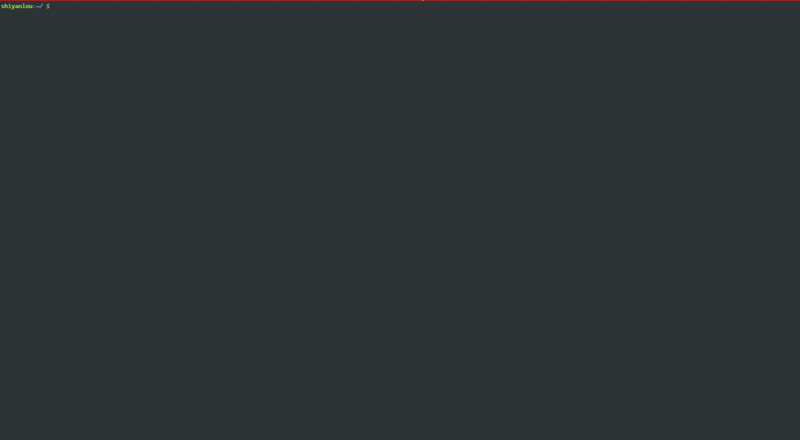

#### 可视模式

2022年3月26日16:37:53

---

#### 可视模式命令简介

- 在普通模式下输入 `v`（小写），进入字符选择模式，就可以移动光标，光标走过的地方就会选取。再次按下 v 后就会取消选取。
- 在普通模式下输入 `Shift+v`（小写），进入行选择模式，按下 V 之后就会把整行选取，您可以上下移动光标选更多的行，同样，再按一次 `Shift+v` 就可以取消选取。
- 在普通模式下输入 `Ctrl+v`（小写），这是区域选择模式，可以进行矩形区域选择，再按一次 `Ctrl+v` 取消选取。
- 在可视模式下输入 `d` 删除选取区域内容
- 在可视模式下输入 `y` 复制选取区域内容

#### 可视模式命令练习

拷贝练习文件到当前目录

```bash
cp /etc/protocols .
```

打开练习文件

```bash
vim protocols
```

- 在普通模式下 `9G` 跳转到第 9 行,输入 `Shift+v`（小写 V），进入可视模式进行行选择，选中 5 行，按下 `>>` 缩进，将 5 行整体缩进一个 `shiftwidth`
- 在普通模式下输入 `Ctrl+v`（小写 V），进入可视模式进行矩形区域选择，选中第一列字符然后 `x` 删除整列

