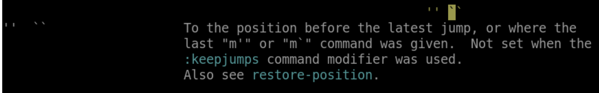

#### 跳回原地

2022年3月25日15:51:50

----

- 如果我使用 G 跳转到最终行
- 然后我想要回到跳转之前的位置
  - 不只是 G 对应的跳转包
  - 还括行跳转、搜索等
- 那这个跳前位置在哪里呢？
  - 我们可以使用 **``** 回到跳转之前的位置
  - ` 位置在键盘 **1** 前面
  - 这个字符就是我们的反引号
  - 叫做 `open single quote chararcter`
  - 可以试着玩玩
- 跳过来再跳过去
- 反复横跳
- 但是这个只能在两个位置之间来回来去的跳

- 我想要跳到更久之前的位置
- 怎么办呢？

