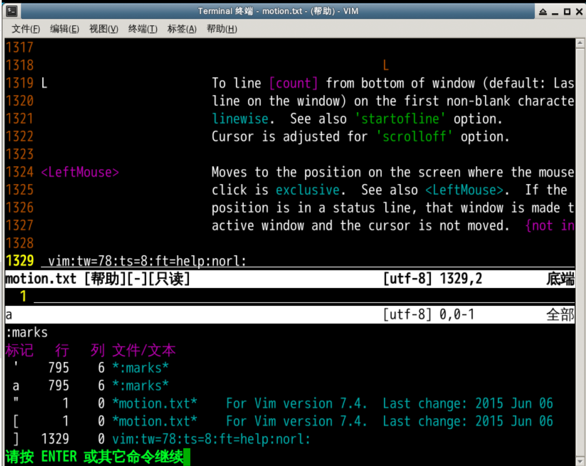

#### 进行定义并进行试验 🤔

2022年3月25日15:55:17

---

- `:se nu` 设置显示行号

- 使用 `ma` 把当前光标的位置做一个标记 `a`

- 然后 G 跳转到最终行

- 这个标记你在文档里面看不见

- ```
  :marks
  ```

   

  来查看所有标记

  - 注意这个 mark 都是包含行和列的具体位置的
  - a 对应795行 6列

