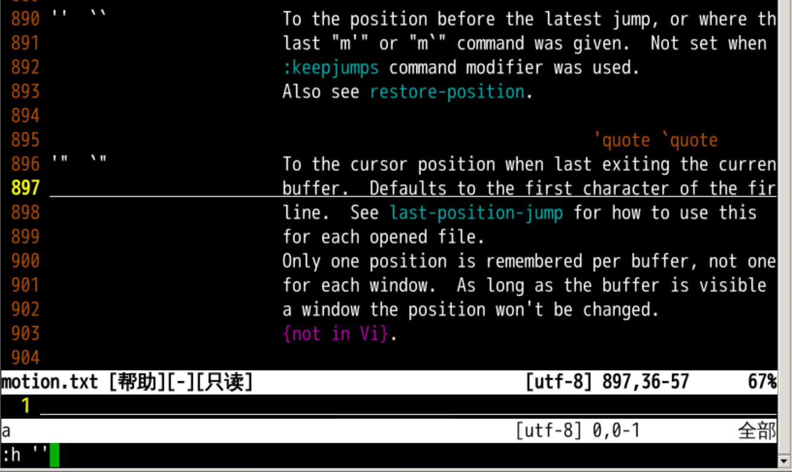
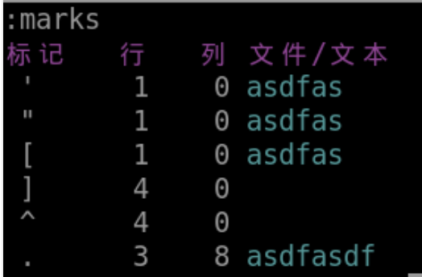

#### 其他标记

2022年3月25日16:48:15

---

- `ma` 是我们自己定义的 `a` 标记
- 其他的标记是什么意思呢？
- 我们可以用 `:h ''` 来看 `''` 的含义

# 更多标记

- `''` 是上次跳转操作光标所在的位置
- `'"` 是上次退出当前文件的位置
- `'[` 是上次编辑（删除修改等）的开始位置
- `']` 是上次编辑（删除修改等）的结束位置
- `'.` 是上次编辑（删除修改等）的最后的操作位置

- 那么，这个大写、小写、数字的标记有什么不同呢？

下一步