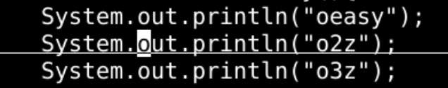
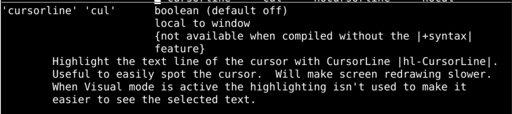
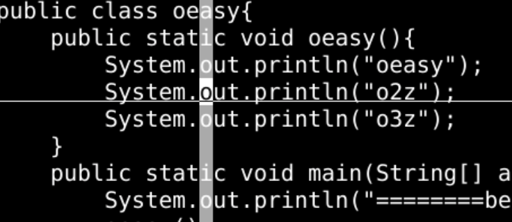
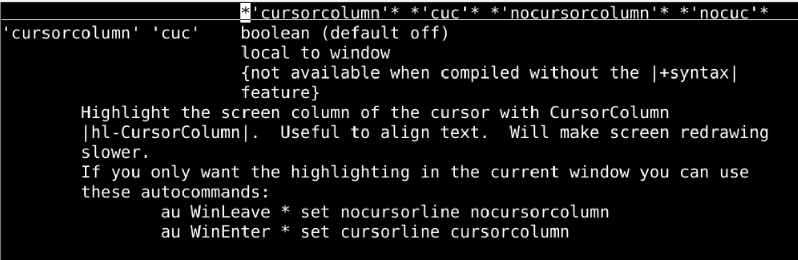
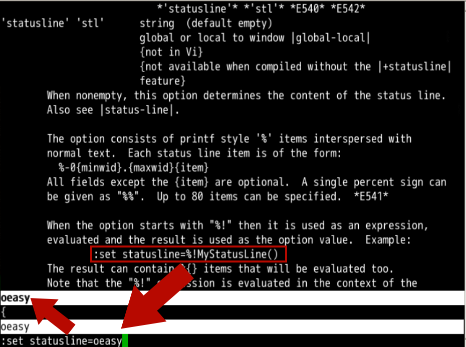
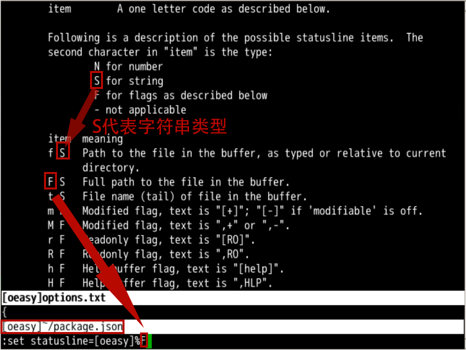
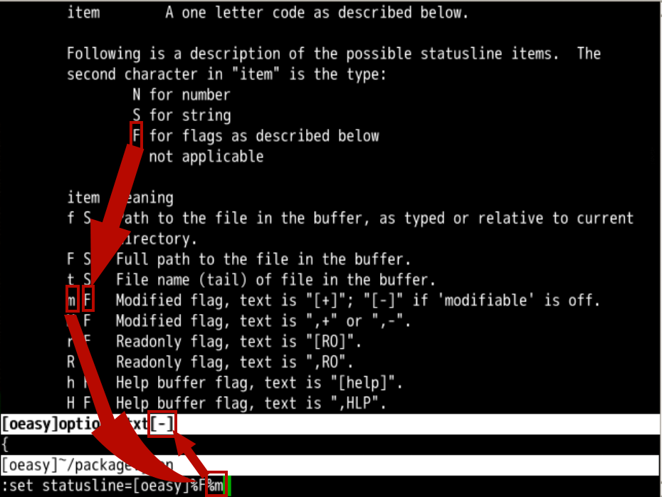

#### 回忆上节课内容🤔


- 我们上次研究了标尺
- 标尺
  - 开启 `se ru`
  - 关闭 `se noru`
- 行号
  - 开启 `se nu`
  - 关闭 `se nonu`
- 命令位置
  - 开启 `se showcmd`
  - 关闭 `se noshowcmd`
- 跳转
  - 用 29 G 跳转行号
  - 用 19 | 跳转列号
  - 用 29 % 跳到整个文件 29% 的

#### 设置光标行


- 来看一个开关option

- 光标行

   

  ```
  cursorline
  ```

  - 光标 `cursor`
  - 行 `line`

- `:set cursorline`



- ```
  h 'cursorline'
  ```

  - 给 `cursorline` 加了单引号
  - 说明 `cursorline` 是一个属性 `option`



---

#### 设置光标列


- 有行就有列

- 光标列

   

  ```
  cursorcolumn
  ```

  - 光标 `cursor`
  - 列 `column`

- `:set cursorcolumn`



- ```
  h 'cursorcolumn'
  ```

  - 给 `cursorcolumn` 加了单引号
  - 说明 `cursorcolumn` 是一个属性 `option`




下一步

---

#### 改变底下的状态横条


- 有了行列位置
- 再配合标尺ruler
- 光标位置就很明确了
- 在 `:h ruler` 的时候
- 偶然发现了一个新天地 `statusline`
  - `statusline` 意思是状态横条
  - 在倒数第 2 行
  - `statusline` 也是一个可以 `set` 的东西
  - 我们来查看一下手册
  - `:h statusline`
  - 好像可以直接给 `statusline` 赋值
  - 我直接赋一个 `oeasy`
- `:set statusline=oeasy`
- 然后还需要设置 `laststatus`
  - 设置 laststatus = 0，不显式状态行
  - 设置 laststatus = 1，仅当窗口多于一个时，显示状态行
  - 设置 laststatus = 2，总是显式状态行
- `:set laststatus=2`

---

#### statusline上可以放什么呢？


- `:h 'statusline'`




#### 显示属性


- 除了字符串常量之外是否能显示一些别的属性呢？

  - 继续翻帮助手册
  - 找到相关的 `items`
  - 各种 `items` 有不同的属性（数字、文本、标志）
  - 每个 `item` 对应一个字母
  - 这个字母需要通过 `%` 来进行转义
  - `F` 对应文件名

- ```
  :set statusline=[oeasy]%F
  ```

  - 此时，状态条就显示 `[oeasy]当前文件名`



---


#### 标志属性6557757


- 继续翻看属性

  - `Flag` 是标志位
  - `m` 是一个关于是否已经修改的标志位
  - 把 `%m` 追加进入 `statusline`

- `:set statusline=[oeasy]%F%m`

- 修改文件后会显示未保存的

   

  ```
  [+]
  ```

  - 观察效果

- 保存后

   

  ```
  [+]
  ```

   

  会消失

  - 暗中观察...

