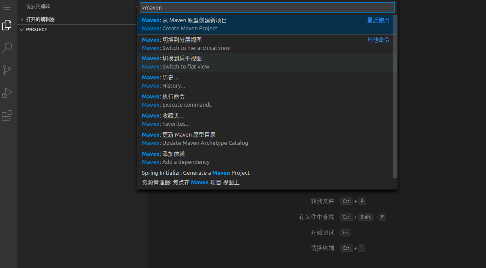
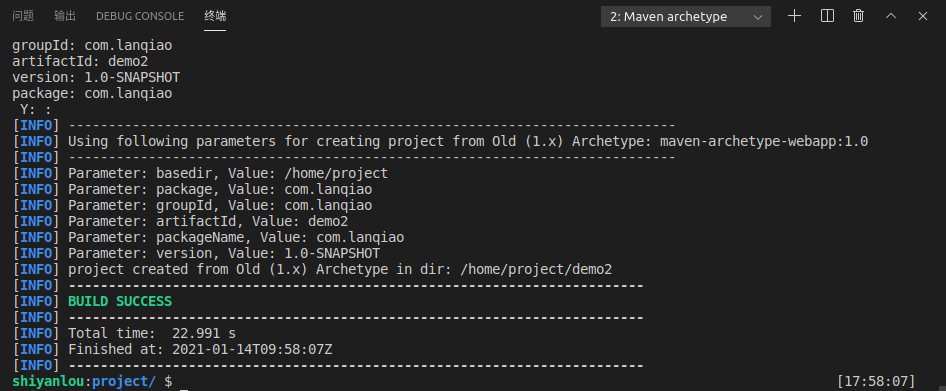

# Java 示例项目
除了前端开发， VS Code 也可以进行 Java Web 开发。在 VS Code 中，Java 主要使用命令行和 Maven 来开发项目。

因为我们在环境中预安装了 Maven 相关的插件，所以可以选择使用命令或者使用插件两种方式初始化项目。

#### 使用插件初始化项目
在代码浏览区找到 MAVEN 项目一栏，点击栏目里的 `+` 号，选择原型 `maven-archetype-webapp`。


或者也可以按下快捷键 `Ctrl + Shift + P`，输入 maven，选择从 Maven 原型创建新项目。



然后回车选择当前默认的 1.4 版本，再按下回车设置储存路径为 `/home/project`。此时终端会自动生成一条命令然后执行，等待包下载完毕，会提示我们输入 groupId 和 artifactId。groupId 输入 `com.lanqiao`，然后按下回车，ArtifactId 输入 `demo`，之后的配置直接回车默认即可。


这样就成功从 Maven 原型创建了一个项目 demo。


#### 输入命令创建
我们也可以在终端中直接输入命令使用 Maven 建立项目：

```Plain Text
mvn archetype:generate -DgroupId=com.lanqiao -DartifactId=demo2 -DarchetypeArtifactId=maven-archetype-webapp

```
稍等片刻，就会创建好一个名为 `demo2` 的 Maven 项目。创建过程中，同样也需要单击几次回车进行步骤确认，不过不需要设置 groupId 和 artifactId，因为命令中已经设置好了。



#### 启动 Maven 项目
接下来，我们尝试启动 Maven 的示例项目。在 Java Web 开发过程中，需要运行 Web 服务进行调试，这个时候就需要 Jetty 或者 Tomcat。所以，需要先修改刚刚新建的 `demo` 项目配置，添加 Jetty maven 插件。

你需要打开 `demo` 文件夹

下方的 `pom.xml` 配置文件，并使用下方配置替换默认内容，复制并粘贴即可。

```xml
<project xmlns="http://maven.apache.org/POM/4.0.0" xmlns:xsi="http://www.w3.org/2001/XMLSchema-instance"
  xsi:schemaLocation="http://maven.apache.org/POM/4.0.0 http://maven.apache.org/maven-v4_0_0.xsd">
  <modelVersion>4.0.0</modelVersion>
  <groupId>com.lanqiao</groupId>
  <artifactId>demo</artifactId>
  <packaging>war</packaging>
  <version>1.0-SNAPSHOT</version>
  <name>demo Maven Webapp</name>
  <url>http://maven.apache.org</url>
    <build>
        <plugins>
            <plugin>
                <groupId>org.eclipse.jetty</groupId>
                <artifactId>jetty-maven-plugin</artifactId>
                <version>9.4.12.v20180830</version>
                <configuration>
                    <scanIntervalSeconds>10</scanIntervalSeconds>
                    <webApp>
                        <contextPath>/</contextPath>
                    </webApp>
                </configuration>
            </plugin>
        </plugins>
    </build>
</project>

```
上方的配置中，我们新增了 `jetty-maven-plugin` 插件支持。接下来，继续在终端操作：

```bash
cd demo
mvn jetty:run
```
上方的命令中，`cd demo` 是切换路径到 `demo` 文件夹中，`mvn jetty:run` 则是启动 Web 服务。由于需要下载的依赖较多，执行后需要稍等一会。项目启动完成之后，你可以看到服务运行在 `8080` 端口。


此时，我们就可以通过蓝桥线上环境提供的 Web 服务，打开运行在 `8080` 端口的 Maven 示例项目。

在环境右侧工具栏中找到「Web 服务」按钮，然后单击打开。


线上环境会自动分配一个临时域名给当前的 Web 服务，你可以在浏览器新的标签页面看到预览效果。


看到 Hello，World 默认页面，意味着刚刚 Maven 项目运行正常。

**特别提醒**：为了保证环境运行安全，线上环境提供的 Web 服务仅监听 `8080` 端口。Jetty 默认运行在 `8080` 端口，其他一些服务运行时则可能需要手动指定或修改端口号。


