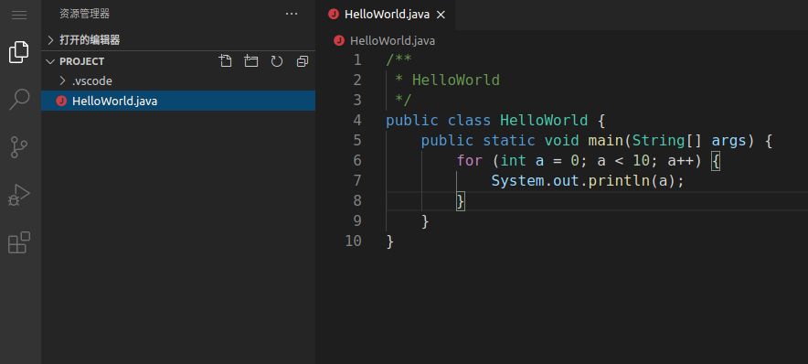
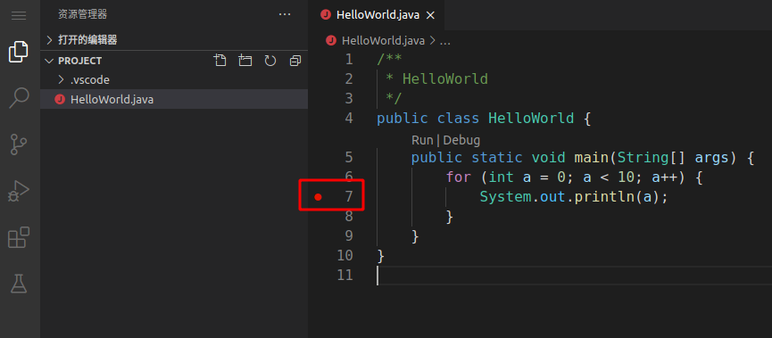
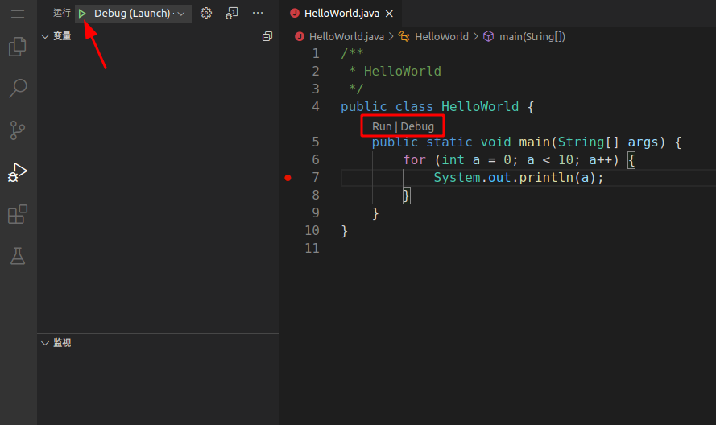
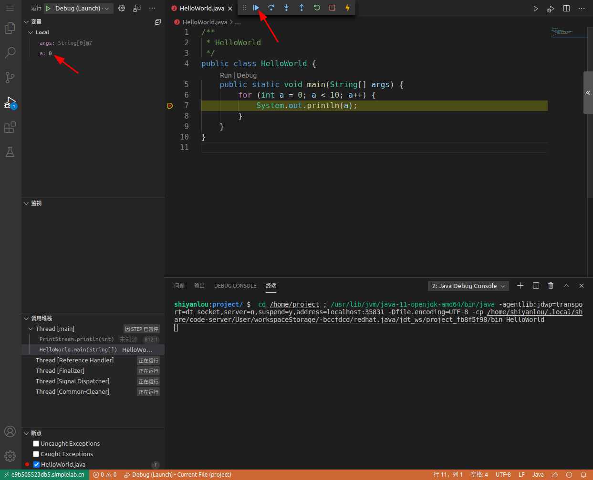
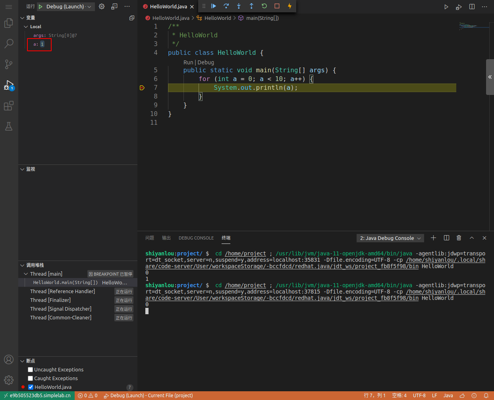
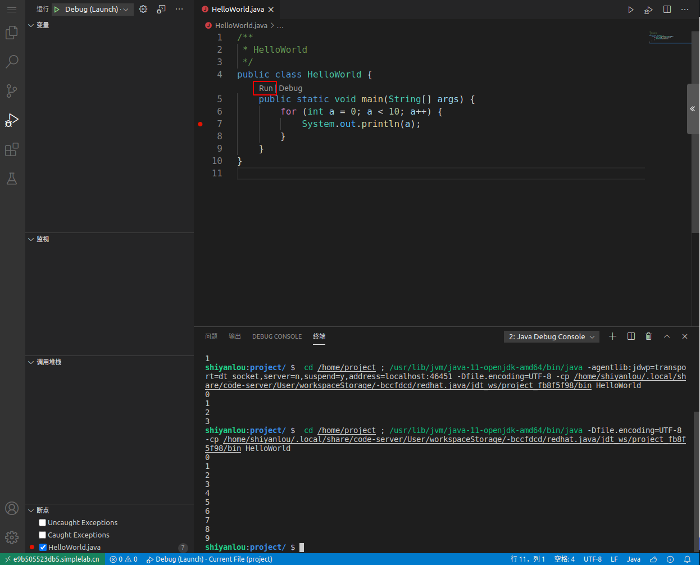

# 代码调试功能
VS Code 环境中预制了 Java 相关的插件，所以可以直接在环境里 Debug Java 代码。

> 其他语言需要自行安装对应的插件。

在代码文件浏览区中点击右键 **新建文件** 创建一个名为 `HelloWorld.java` 的 Java 文件，然后在编辑区域输入以下代码：

```Plain Text
/**
 * HelloWorld
 */
public class HelloWorld {
    public static void main(String[] args) {
        for (int a = 0; a < 10; a++) {
            System.out.println(a);
        }
    }
}

```


我们在 `System.out.println(a);` 处打上断点，以便查看 for 循环中变量 a 的值的变化。首先将鼠标放到代码对应的行号前，将出现的小红点点亮。



然后点击左侧运行图标，切换到调试的界面。可以点击上方的绿色运行标志，或者文件编辑栏里出现的 Debug 按钮开始调试。



开始调试后，终端会自动执行调试命令，左侧区域会显示变量和堆栈相关的信息，状态栏会变为橘黄色并且显示调试状态，顶部会显示一个调试工具栏。可以看到当前变量 a 的值为 0，点击上方的继续按钮执行一次调试。



程序会自动执行一次循环，a 的值变为 1。



如果要详细查看执行的每一个步骤，可以点击第二个单步跳过按钮，会高亮显示在变量 a 的值发生变化前执行过的代码。停止调试可以点击停止按钮，或者按下快捷键 Shift + F5。

如果不需要调试，也可以直接点击 Run 运行程序，同样会在下方终端里自动执行并输出结果。




