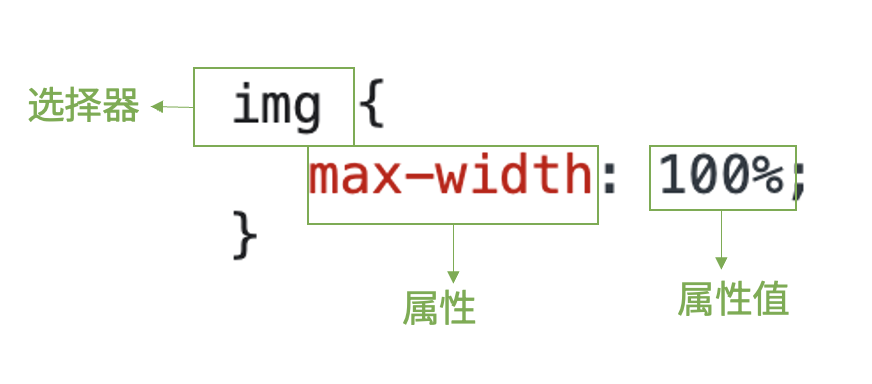
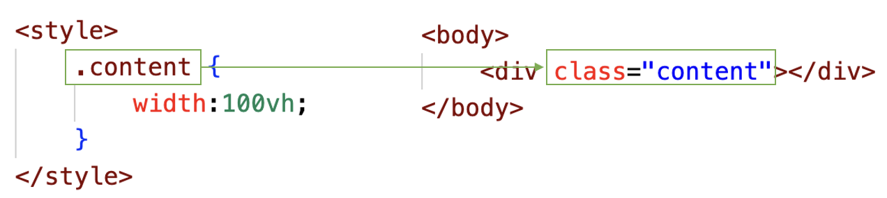
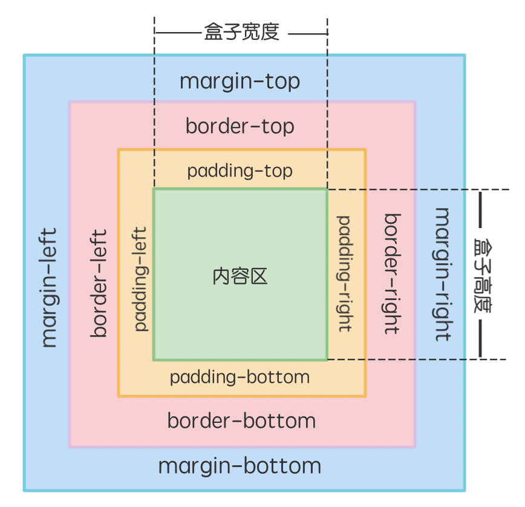

| `<title>`  | 定义页面标题内容。                                           |
| ---------- | ------------------------------------------------------------ |
| `<meta>`   | 有关文档本身的元信息，例如：文档的作者，用于查询的关键词，关于文档的描述等。 |
| `<style>`  | 定义 CSS 层叠样式表的内容。                                  |
| `<link>`   | 定义外部文件的链接，最常见的用途是链接外部样式表。           |
| `<script>` | 定义页面中程序脚本的内容。                                   |

CSS 选择器

[CSS](https://developer.mozilla.org/zh-CN/docs/Web/CSS)，英文全称是 Cascading Style Sheets，中文翻译为层叠样式表，它描述了 HTML 中的元素如何被渲染的问

* `#id 名` 来表示，id 名必须唯一
* `html`、`body` 是标签名选择
* `*` 号是通用选择器
* class 选择器是选取页面中指定 class 的元素，class 名不唯一

#### 盒子模型

盒子模型=外边距+边框+内边距+宽 / 高

