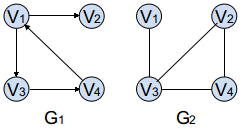

#### 图

2022年4月9日18:23:30

---

下面就通过一个例子来让大家快速地知道什么是图，如下图所示，G1 是**有向图**，G2 是**无向图**，每个数据元素称为**顶点**，在有向图中，从 V1 到 V3 称为一条**弧**，V3 到 V1 为另一条弧，V1 称为**弧尾**，V3 称为**弧头**，在无向图中，从 V1 到 V3 称为一条**边**。

有 n 个顶点，n(n-1)/2 条边的无向图称为**完全图**，有 n*(n-1)条弧有向图称为**有向完全图**，有很少条边或图称为**稀疏图**，反之称为**稠密图**。在 G2 无向图中，类似 V3 与 V1、V2 和 V4 之间有边的互称为**邻接点**，与顶点相关联的边数称为顶点的**度**，例如 V3 顶点的度为 3，而在 G1 有向图中，顶点的**度**是顶点的出度和入度之和，以顶点为头的弧的数目称为**入度**，为尾的弧的数目称为**出度**，例如 V1 顶点的出度为 2，入度为 1，它的度为 1+2=3。

从一个顶点到另一个顶点的顶点序列称为**路径**，在有向图中，路径是有方向的，路径上边或弧的数目称为路径的长度，如果一条路径中的起始顶点跟结束结点相同，那么称这个路径为**环或回路**，不出现重复顶点的路径称为**简单路径**。无向图中，如果一个顶点到另一个顶点有路径，那么它们就是**连通的**，如果图中的任意两个顶点都是连通的，那么这个图就是**连通图**，无向图中的极大连通子图称为连通分量，如果是有向图中的任意一对顶点都有路径，那么这个图就是**强连通图**，相应的它的极大连通子图就称为**强连通分量**。一个连通图的一个极小连通子图，它包含所有顶点，但足以构成一棵树的 n-1 条边，加一条边必定会形成环，这个就称为**生成树**。

#### 概念介绍

- **无向图** 图是若干个顶点(Vertices)和边(Edges)相互连接组成的。边仅由两个顶点连接，并且没有方向的图称为无向图。
- **有向图** 在有向图中，边是单向的：每条边连接的两个顶点都是一个有序对，它们的邻接性是单向的。我们开发过程中碰到的很多场景都是有向图：比如任务调度的依赖关系，社交网络的任务关系等等都是天然的有向图。
- **度** 一个顶点的度是指与该顶点相关联的边的条数，顶点 v 的度记作 d(v)。