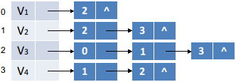

#### 图的实现

2022年4月9日18:27:1234:

---

表示图通常有四种方法：数组表示法、邻接表、十字链表和邻接多重表。邻接表是图的一种链式存储结构，十字链表是有向图的另一种链式存储结构，邻接多重表是无向图的另一种链式存储结构。这里主要讲解一下邻接表的表示和实现，邻接表中有两种结点，一种是头结点，另一种是表结点，头结点中存储一个顶点的数据和指向链表中第一个结点，表结点中存储当前顶点在图中的位置和指向下一条边或弧的结点，表头结点用链式或顺序结构方式存储，如下图所示就是上图 G2 无向图的邻接表表示。

