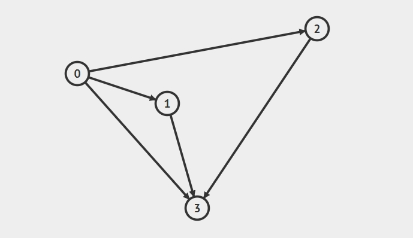

#### 图的邻接表实现 😛👨‍🏫💛💛

2022年4月9日18:22:35

---

对于有向图的邻接表表示形式，图的边可以使用字典数据结构来表示。

下面给出无向图的参考代码(对于有向图，请自行修改，这里不再提示)

```python
class Graph(object):
    def __init__(self):
        self.nodes = []  # 表示图的点集
        self.edge = {}  # 表示图的边集  字典中键为节点, 值为list,  存储当前节点的后继节点

    def insert(self, a, b):
        # 如果 a 不在图的点集里，则添加 a
        if not(a in self.nodes):
            self.nodes.append(a)
            self.edge[a] = list()
        # 如果 b 不在图的点集里，则添加 b
        if not(b in self.nodes):
            self.nodes.append(b)
            self.edge[b] = list()
        # a 连接 b
        self.edge[a].append(b)
        # b 连接 a
        self.edge[b].append(a)

    def succ(self, a):
        # 返回与 a 连接的点
        return self.edge[a]

    def show_nodes(self):
        # 返回图的点集
        return self.nodes

    def show_edge(self):
        print(self.edge)


graph = Graph()
graph.insert('0', '1')
graph.insert('0', '2')
graph.insert('0', '3')
graph.insert('1', '3')
graph.insert('2', '3')
graph.show_edge()
```

该 graph 储存形式为：

{'0': ['1', '2', '3'], '1': ['0', '3'], '2': ['0', '3'], '3': ['0', '1', '2']}




