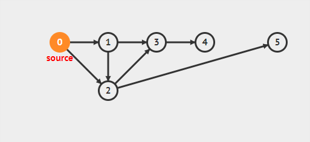

#### 深度优先遍历

2022年4月9日18:38:57

---

> ###### 树的[遍历](https://so.csdn.net/so/search?q=遍历&spm=1001.2101.3001.7020)方式
>
> 树的遍历方式总体分为两类：[深度优先搜索](https://so.csdn.net/so/search?q=深度优先搜索&spm=1001.2101.3001.7020)（DFS）、广度优先搜索（BFS），其实这两种方式主要是图的遍历方式，但是树可以被抽象为简单的图，所以这两种方式也可以作为树的遍历方式。
>
> - 常见的DFS：先序遍历、中序遍历、后序遍历
> - 常见的BFS：层序遍历（按层遍历）

深度优先搜索(DFS) 是树的先根遍历的推广，它的基本思想是：

从根节点出发，沿着左子树方向进行纵向遍历，直到找到叶子节点为止。然后回溯到前一个节点，进行右子树节点的遍历，直到遍历完所有可达节点为止。

演示：从给定图中，实现 DFS

在 `/home/shiyanlou/` 下新建一个文件 `dfs.py`。


参考代码如下：

```python
def dfs(G,s,S=None,res=None):
    if S is None:
        # 储存已经访问节点
        S=set()
    if res is None:
        # 存储遍历顺序
        res=[]
    res.append(s)
    S.add(s)
    for u in G[s]:
        if u in S:
            continue
        S.add(u)
        dfs(G,u,S,res)

    return res

G = {'0': ['1', '2'],
     '1': ['2', '3'],
     '2': ['3', '5'],
     '3': ['4'],
     '4': [],
     '5': []}

print(dfs(G, '0'))
```

效果如下：




