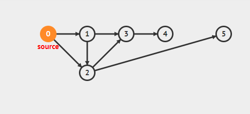

#### 广度优先遍历

2022年4月11日19:00:51

---


广度优先搜索(BFS)是树的按层次遍历的推广，它的基本思想是：

首先访问初始点 vi，并将其标记为已访问过，接着访问 vi 的所有未被访问过的邻接点 vi1,vi2,..., vin，并均标记已访问过，然后再按照 vi1,vi2,..., vin 的次序，访问每一个顶点的所有未被访问过的邻接点，并均标记为已访问过，依次类推，直到图中所有和初始点 vi 有路径相通的顶点都被访问过为止。

演示：从给定图中，实现 BFS

在 `/home/shiyanlou/` 下新建一个文件 `bfs.py`。

参考代码如下：

```python
def bfs(graph, start):
    # explored：已经遍历的节点列表，queue:寻找待遍历的节点队列
    explored, queue = [], [start]
    explored.append(start)
    while queue:
        # v:将要遍历的某节点
        v = queue.pop(0)
        # w:节点 v 的邻居
        for w in graph[v]:
            # w:如果 w 未被遍历，则遍历
            if w not in explored:
                # 添加 w 节点到已遍历的节点列表
                explored.append(w)
                # 添加 w 节点到寻找待遍历的节点队列
                queue.append(w)
    return explored

G = {'0': ['1', '2'],
     '1': ['2', '3'],
     '2': ['3', '5'],
     '3': ['4'],
     '4': [],
     '5': []}

print(bfs(G, '0'))
```

效果如下：




