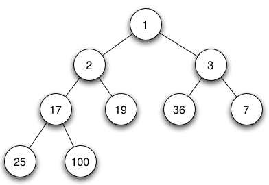

树

树 (tree) 是一种非常高效的非线性存储结构。树，可以很形象的理解，有根，有叶子，对应在数据结构中就是根节点、叶子节点，同一层的叶子叫兄弟节点，邻近不同层的叫父子节点，非常好理解。

注：定义来自百度百科。

#### 其他概念解释

- **二叉树**，就是每个节点都至多有二个子节点的树。
- **满二叉树**，就是除了叶子节点外，每个节点都有左右两个子节点，这种二叉树叫做满二叉树。
- **完全二叉树**，就是叶子节点都在最底下两层，最后一层叶子节都靠左排列，并且除了最后一层，其他层的节点个数都要达到最大，这种二叉树叫做完全二叉树。

常见的二叉树如下图所示

