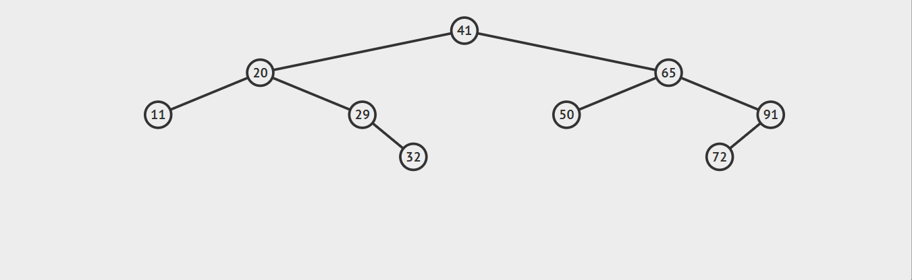

#### 基本功能介绍 (树的主要操作)


在接下来的内容里，我们将逐步介绍二叉树的具体功能是如何实现的。

**思路：**

1. 先定义一个节点 node 类，存储数据 data 和左子节点 left 以及 右子节点 right。
2. 再实现二叉树 binary_tree 的类，应至少有以下属性和函数： 属性：有一个根节点（root) , 它是 node 类。 函数：添加子节点 add ，返回父节点 get_parent，删除子节点 delete。

步骤如下：

**1. 创建 Node 类**

创建一个 Node 的类，作为基础数据结构：链点，并初始化对应的内参。

具体实现代码如下：

```python
class Node(object):
    def __init__(self, item):
        self.item = item  # 表示对应的元素
        self.left = None  # 表示左子节点
        self.right = None  # 表示右子节点

    def __str__(self):
        # print 一个 Node 类时会打印 __str__ 的返回值
        return str(self.item)
```

**2. 创建 Tree 类**

创建一个 Tree 的类，定义根节点。

具体实现代码如下：

```python
class Tree(object):
    def __init__(self):
        # 根节点定义为 root 永不删除，作为哨兵使用
        self.root = Node('root')
```

**3. 添加 add 函数**

添加一个 add(item) 的函数，功能是添加子节点到树里面。

具体实现代码如下：

```python
    def add(self, item):
        node = Node(item)
        # 如果二叉树为空，那么添加的点将插入 root 节点处
        if self.root is None:
            self.root = node
        else:
            # 在 q 列表中，添加二叉树的根节点
            q = [self.root]
            while True:
                pop_node = q.pop(0)
                # 左子树为空则将点添加到左子树
                if pop_node.left is None:
                    pop_node.left = node
                    return
                # 右子树为空则将点添加到右子树
                elif pop_node.right is None:
                    pop_node.right = node
                    return
                else:
                    q.append(pop_node.left)
                    q.append(pop_node.right)
```

**4. 添加 get_parent 函数**

添加一个 get_parent(item) 函数，功能是找到 item 的父节点。

具体实现代码如下：

```python
    def get_parent(self, item):
        if self.root.item == item:
            # 根节点没有父节点
            return None
        # 在 tmp 列表中，添加二叉树的根节点
        tmp = [self.root]
        while tmp:
            pop_node = tmp.pop(0)
            # 如果点的左子树为要寻找的点
            if pop_node.left and pop_node.left.item == item:
                # 返回这个点，即为寻找点的父节点
                return pop_node
            # 如果点的右子树为要寻找的点
            if pop_node.right and pop_node.right.item == item:
                # 返回这个点，即为寻找点的父节点
                return pop_node
            # 添加 tmp 列表里的元素
            if pop_node.left is not None:
                tmp.append(pop_node.left)
            if pop_node.right is not None:
                tmp.append(pop_node.right)
        return None
```

**5. 添加 delete 函数**

添加一个 delete(item) 函数，功能是从二叉树中删除一个子节点。

思路如下：

```bash
先获取待删除节点 item 的父节点（以下简称 item）。
    如果父节点不为空，判断 item 的左右子树是否存在：
        当左子树为空时，进一步判断 item 是父节点的左孩子，还是右孩子；
            如果是左孩子，将父节点的左指针指向 item 的右子树，反之将父节点的右指针指向 item 的右子树。
        当右子树为空时，进一步判断 item 是父节点的左孩子，还是右孩子；
            如果是左孩子，将父节点的左指针指向 item 的左子树，反之将父节点的右指针指向 item 的左子树。
        当左右子树均不为空时，寻找右子树中的最左叶子节点 x，将 x 替代要删除的节点。
    删除成功，返回 True。
    删除失败, 返回 False。
```

效果演示：对已知二叉树删除元素 32



具体实现代码如下：

```python
    def delete(self, item):
        # 如果根为空，就什么也不做
        if self.root is None:
            return False

        parent = self.get_parent(item)
        if parent:
            # 确定待删除节点
            del_node = parent.left if parent.left.item == item else parent.right
            # 待删除节点的左子树为空时
            if del_node.left is None:
                # 如果待删除节点是父节点的左孩子
                if parent.left.item == item:
                    parent.left = del_node.right
                # 如果待删除节点是父节点的右孩子
                else:
                    parent.right = del_node.right
                # 删除变量 del_node
                del del_node
                return True
            # 待删除节点的右子树为空时
            elif del_node.right is None:
                # 如果待删除节点是父节点的左孩子
                if parent.left.item == item:
                    parent.left = del_node.left
                # 如果待删除节点是父节点的右孩子
                else:
                    parent.right = del_node.left
                # 删除变量 del_node
                del del_node
                return True
            # 左右子树都不为空时
            else:
                tmp_pre = del_node
                # 待删除节点的右子树
                tmp_next = del_node.right
                # 寻找待删除节点右子树中的最左叶子节点并完成替代
                if tmp_next.left is None:
                    # 替代
                    tmp_pre.right = tmp_next.right
                    tmp_next.left = del_node.left
                    tmp_next.right = del_node.right
                else:
                    # 让 tmp_next 指向右子树的最左叶子节点
                    while tmp_next.left:
                        tmp_pre = tmp_next
                        tmp_next = tmp_next.left
                    # 替代
                    tmp_pre.left = tmp_next.right
                    tmp_next.left = del_node.left
                    tmp_next.right = del_node.right
                # 如果待删除节点是父节点的左孩子
                if parent.left.item == item:
                    parent.left = tmp_next
                # 如果待删除节点是父节点的右孩子
                else:
                    parent.right = tmp_next
                del del_node
                return True
        else:
            return False
```

在 `/home/shiyanlou/` 下新建一个文件 `binary_tree.py`。

最终完整代码如下：

```python
class Node(object):
    def __init__(self, item):
        self.item = item  # 表示对应的元素
        self.left = None  # 表示左子节点
        self.right = None  # 表示右子节点

    def __str__(self):
        # print 一个 Node 类时会打印 __str__ 的返回值
        return str(self.item)


class Tree(object):
    def __init__(self):
        # 根节点定义为 root 永不删除，作为哨兵使用。
        self.root = Node('root')

    def add(self, item):
        node = Node(item)
        # 如果二叉树为空，那么添加的点将插入 root 节点处
        if self.root is None:
            self.root = node
        else:
            # 在 q 列表中，添加二叉树的根节点
            q = [self.root]
            while True:
                pop_node = q.pop(0)
                # 左子树为空则将点添加到左子树
                if pop_node.left is None:
                    pop_node.left = node
                    return
                # 右子树为空则将点添加到右子树
                elif pop_node.right is None:
                    pop_node.right = node
                    return
                else:
                    q.append(pop_node.left)
                    q.append(pop_node.right)

    def get_parent(self, item):
        if self.root.item == item:
            # 根节点没有父节点
            return None
        # 在 tmp 列表中，添加二叉树的根节点
        tmp = [self.root]
        while tmp:
            pop_node = tmp.pop(0)
            # 如果点的左子树为要寻找的点
            if pop_node.left and pop_node.left.item == item:
                # 返回这个点，即为寻找点的父节点
                return pop_node
            # 如果点的右子树为要寻找的点
            if pop_node.right and pop_node.right.item == item:
                # 返回这个点，即为寻找点的父节点
                return pop_node
            # 添加 tmp 列表里的元素
            if pop_node.left is not None:
                tmp.append(pop_node.left)
            if pop_node.right is not None:
                tmp.append(pop_node.right)
        return None

    def delete(self, item):
        # 如果根为空，就什么也不做
        if self.root is None:
            return False

        parent = self.get_parent(item)
        if parent:
            # 确定待删除节点
            del_node = parent.left if parent.left.item == item else parent.right
            # 待删除节点的左子树为空时
            if del_node.left is None:
                # 如果待删除节点是父节点的左孩子
                if parent.left.item == item:
                    parent.left = del_node.right
                # 如果待删除节点是父节点的右孩子
                else:
                    parent.right = del_node.right
                # 删除变量 del_node
                del del_node
                return True
            # 待删除节点的右子树为空时
            elif del_node.right is None:
                # 如果待删除节点是父节点的左孩子
                if parent.left.item == item:
                    parent.left = del_node.left
                # 如果待删除节点是父节点的右孩子
                else:
                    parent.right = del_node.left
                # 删除变量 del_node
                del del_node
                return True
            else:  # 左右子树都不为空
                tmp_pre = del_node
                # 待删除节点的右子树
                tmp_next = del_node.right

                # 寻找待删除节点右子树中的最左叶子节点并完成替代
                if tmp_next.left is None:
                    # 替代
                    tmp_pre.right = tmp_next.right
                    tmp_next.left = del_node.left
                    tmp_next.right = del_node.right
                else:
                    # 让 tmp_next 指向右子树的最左叶子节点
                    while tmp_next.left:c
                        tmp_pre = tmp_next
                        tmp_next = tmp_next.left
                    # 替代
                    tmp_pre.left = tmp_next.right
                    tmp_next.left = del_node.left
                    tmp_next.right = del_node.right
                # 如果待删除节点是父节点的左孩子
                if parent.left.item == item:
                    parent.left = tmp_next
                # 如果待删除节点是父节点的右孩子
                else:
                    parent.right = tmp_next
                del del_node
                return True
        else:
            return False
```

对上述 delete函数的改进, 以及遍历绘制 树

```python
    def delete(self, item):
        # 如果根为空，就什么也不做
        if self.root is None:
            return False

        parent = self.get_parent(item)
        if parent:
            # 确定待删除节点
            del_node = parent.left if parent.left.item == item else parent.right
            # 待删除节点的左子树为空时
            if del_node.left is None:
                # 如果待删除节点是父节点的左孩子
                if parent.left.item == item:
                    parent.left = del_node.right
                # 如果待删除节点是父节点的右孩子
                else:
                    parent.right = del_node.right
                # 删除变量 del_node
                del del_node
                return True
            # 待删除节点的右子树为空时
            elif del_node.right is None:
                # 如果待删除节点是父节点的左孩子
                if parent.left.item == item:
                    parent.left = del_node.left
                # 如果待删除节点是父节点的右孩子
                else:
                    parent.right = del_node.left
                # 删除变量 del_node
                del del_node
                return True
            else:  # 左右子树都不为空, 找右子树最左边的替换,或者左子树最右边的, 因为他们只有一个
                if del_node.right.left is None:
                    parent.right = del_node.right
                else:
                    pre = del_node.right
                    cur = pre.left
                    while cur.left:
                            cur = cur.left
                    pre.left = cur.right
                    cur.left = del_node.left
                    parent.right = cur
                del del_node
                return True

def draw(self, node, n):
        if node is None:
            return  
        self.draw(node.right,n+1)
        for i in range(0, n+1):
            print("   ",end=" ")
        print(node.item)
        self.draw(node.left,n+1)
```

