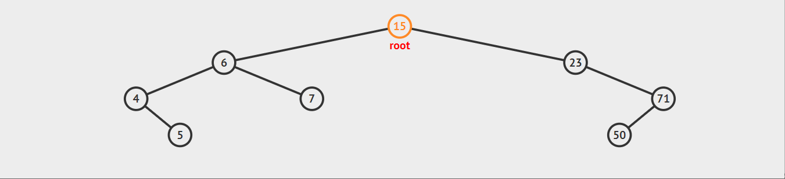

#### 二叉树的遍历问题


遍历原理：

二叉树的遍历：是指从根结点出发，按照某种次序依次访问二叉树中的所有结点，使得每个结点被访问一次且仅被访问一次。

这里有两个关键词：访问和次序。

访问其实是要根据实际的需要来确定具体做什么，比如对每个结点进行相关计算，输出打印等。它算作是一个抽象操作。

二叉树的遍历次序不同于线性结构，最多也就是从头到尾、循环和双向等简单的遍历方式。树的结点之间不存在唯一的前驱和后继关系，在访问一个结点后，下一个被访问的结点面临着不同的


#### 二叉树遍历方法


二叉树的遍历方式可以有很多，如果我们限制从左到右的顺序，就主要分为三种：

1. 中序遍历
2. 后序遍历
3. 前序遍历


#### 中序遍历

1. 先处理左子树，然后处理当前节点，再处理右子树；
2. 对于一颗二叉查找树，所有的信息都是有序排列的，中序遍历可以是信息有序输出，且运行时间为 O（n）；
3. 递归实现中序遍历。

在之前的 Tree 类里面添加 inorder 函数

参考代码如下：

```python
    def inorder(self,node):  # 中序遍历
        if node is None:
            return []
        result = [node.item]
        left_item = self.inorder(node.left)
        right_item = self.inorder(node.right)
        return left_item + result + right_item
```

中序遍历的效果演示:




#### 后序遍历


1. 先处理左右子树，然后再处理当前节点，运行时间为 O（n）
2. 递归实现后序遍历

参考代码如下：

```python
    def postorder(self,node):  # 后序遍历
        if node is None:
            return []
        result = [node.item]
        left_item = self.postorder(node.left)
        right_item = self.postorder(node.right)
        return left_item + right_item + result
```

#### 先序遍历


1. 先处理当前节点，再处理左右子树；
2. 递归实现先序遍历。

参考代码如下：

```python
    def preorder(self,node):  # 先序遍历
        if node is None:
            return []
        result = [node.item]
        left_item = self.preorder(node.left)
        right_item = self.preorder(node.right)
        return result + left_item + right_item
```