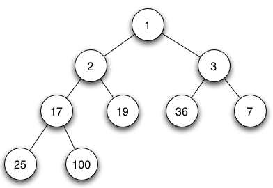
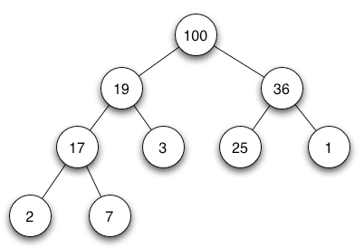

#### 堆

2022年4月7日16:46:08

---

堆 (heap) 是一种经过排序的完全二叉树，其中任一非叶子节点的值均不大于（或不小于）其左孩子和右孩子节点的值。

注：定义来自百度百科。

堆，又被为优先队列(priority queue)。尽管名为优先队列，但堆并不是队列。

#### 其他概念解释

- **最大堆** 根结点的键值是所有堆结点键值中最大者。
- **最小堆** 根结点的键值是所有堆结点键值中最小者。

最小堆

最大堆

