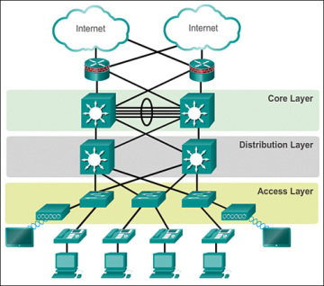
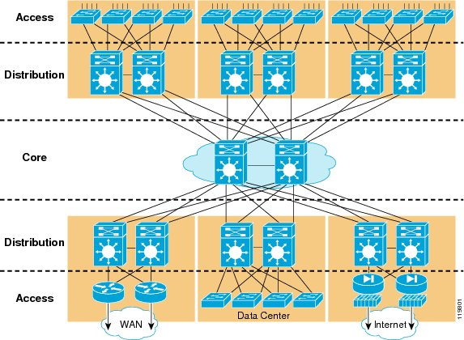
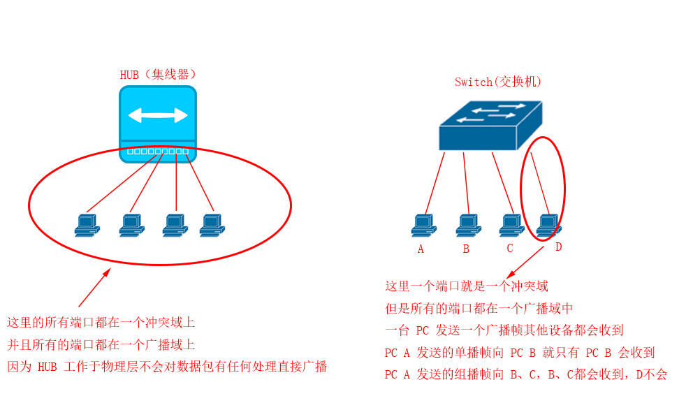

<<<<<<< HEAD
Version:0.9 StartHTML:0000000105 EndHTML:0000007071 StartFragment:0000000141 EndFragment:0000007031

ElementType Median3( ElementType A[], int Left, int Right ) 

{ 

int Center = (Left+Right) / 2; 

if ( A[Left] > A[Center] ) 

Swap( &A[Left], &A[Center] ); 

if ( A[Left] > A[Right] ) 

Swap( &A[Left], &A[Right] ); 

if ( A[Center] > A[Right] ) 

Swap( &A[Center], &A[Right] ); 

/* 此时A[Left] <= A[Center] <= A[Right] */ 

Swap( &A[Center], &A[Right-1] ); /* 将基准Pivot藏到右边*/ 

/* 只需要考虑A[Left+1] … A[Right-2] */ 

return A[Right-1]; /* 返回基准Pivot */ 

}

void Qsort( ElementType A[], int Left, int Right ) 

{ /* 核心递归函数 */ 

int Pivot, Cutoff, Low, High; 

if ( Cutoff <= Right-Left ) { /* 如果序列元素充分多，进入快排 */ 

Pivot = Median3( A, Left, Right ); /* 选基准 */ 

Low = Left; High = Right-1; 

while (1) { /*将序列中比基准小的移到基准左边，大的移到右边*/ 

while ( A[++Low] < Pivot ) ; 

while ( A[--High] > Pivot ) ; 

if ( Low < High ) Swap( &A[Low], &A[High] ); 

else break; 

}

Swap( &A[Low], &A[Right-1] ); /* 将基准换到正确的位置 */ 

Qsort( A, Left, Low-1 ); /* 递归解决左边 */ 

Qsort( A, Low+1, Right ); /* 递归解决右边 */ 

}

else InsertionSort( A+Left, Right-Left+1 ); /* 元素太少，用简单排序 */ 

}
=======
### 实验4 局域网和交换机

2022年06月27日23:58:31

#### 局域网拓扑设计

1. 核心层（the core Layer）
2. 汇聚层（Distribution）
3. 接入层（Access）

三层示意图如下

### 以太网

#### 路由器和集线器的区别

- 冲突域
- 广播域

1. 单播帧

2. 组播帧

3. 广播帧

   
>>>>>>> 79d46d3edad8ff57fb3a0af617836c9397070117
